#### <font color="blue">运用脚手架添加菜单</font>

---

1. 启动项目后进入【代码生成器】页面。在这里我们创建一个ProjectA的结构体

	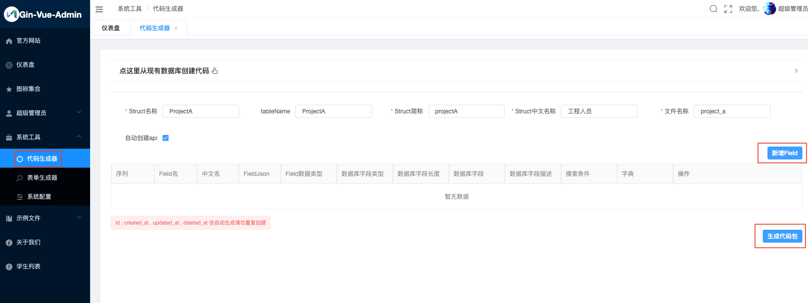
	
	* Struct名称：即后台代码中 model 文件夹下的结构体文件中，结构体的名称，首字母大写。
	* tableName：数据库中生成的与结构体对应的数据表名。
	* Struct简称：用于结构体作为参数时的名称，以及路由 group 名称。这里一般与Stuct名称对应，但是首字母小写。
	* Struct中文名称：作为自动api描述，也是左侧菜单显示时的默认菜单名。
	* 文件名称：使用 xxx_xxx 形式命名。生成后端代码时，model下的文件名会用这里的命名。
	* 自动创建api：选中，如果不选则不会自动创建api表，需要自己去api管理里面手动增加对应路由。
	
2. 点击【新增field】按钮，为数据表、struct结构体创建字段。这里我们创建了Name, Male, Age三个字段

	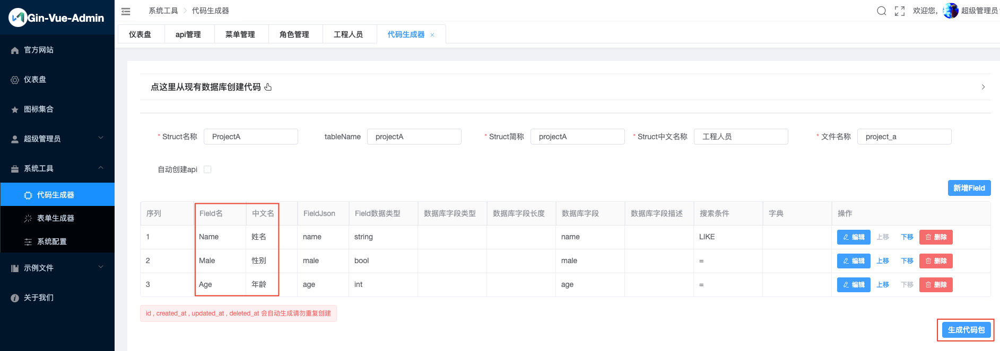

	* Field名称：struct结构体中的字段名称，首字母大写
	* Field中文名：对应struct结构体tag中的comment字段值，也是数据列表展示表格的表头名称。
	* FieldJSON：对应struct结构体tag中的json字段值。在使用struct对象调用某个字段时，使用“对象.json字段值”
	* 数据库字段名：对应数据库中的字段名称
	* Field数据类型：对应struct结构体中的字段类型
	* Field查询条件：用于实现该对象数据列表的条件查询

	以下字段目前填写会导致gorm建表失败，暂时不要填：
	
	* 数据库字段描述：对应数据库中的列Comment值
	* 数据库字段类型：对应生成的数据表中的字段类型
	* 数据库字段长度：对应生成的数据表中的字段长度

3. 完成后点击【生成代码包】按钮，即可下载一个文件压缩包。解压后的代码结构如下：

	```js
	.
	├── fe // 前端代码
	│   └── project_a
	│       ├── api
	│       │   └── project_a.js
	│       └── table
	│           └── project_a.vue
	├── readme.txt
	└── te // 后端代码
	    └── project_a
	        ├── api
	        │   └── project_a.go
	        ├── model
	        │   └── project_a.go
	        ├── request
	        │   └── project_a.go
	        ├── router
	        │   └── project_a.go
	        └── service
	            └── project_a.go
	```
	
4. 添加前端代码
	* 将`fe/project_a/api/project_a.js`放入项目的`web/src/api`目录下
	* 在项目的`web/src/view`下新建一个`project_a`的目录，将`fe/project_a/table/project_a.vue`放进去

	> 若是直接拖拽到HbuilderX中，会自动编译运行添加后的前端代码

5. 添加后台代码
	* 将`te/project_a/api/project_a.go`放入项目的`server/api/v1`目录下
	* 将`te/project_a/model/project_a.go`放入项目的`server/model`目录下
	* 将`te/project_a/request/project_a.go`放入项目的`server/model/request`目录下
	* 将`te/project_a/router/project_a.go`放入项目的`server/router`目录下
	* 将`te/project_a/service/project_a.go`放入项目的`server/service `目录下

6. 注册路由和数据库。
	* server/initialize/router.go

		```js
		在global.GVA_LOG.Info("router register success")前一行添加
		
		router.InitProjectARouter(ApiGroup)
		```
		
	* server/initialize/gorm.go

		```js
		在err := db.AutoMigrate()方法的末尾添加
		
		model.ProjectA{},
		```
		
	> 注册完成后，重新`go run main.go`更新一下后台，就自动生效了
		
7. 进入【菜单管理】页面，点击【新增根菜单】，配置目录菜单。
	
	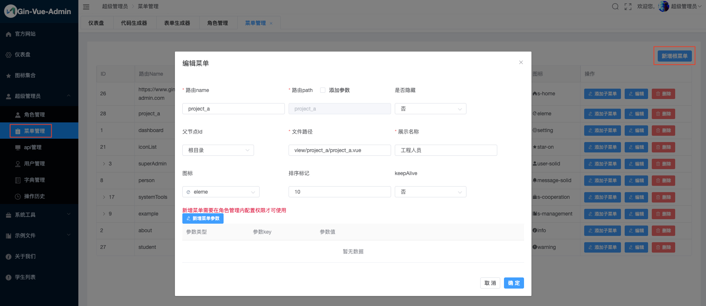
	
	* 路由name：对应进入列表显示页面时的访问路径
	* 路由path：选中后边的“添加参数”后才可以输入，对应进入列表显示页面时访问路径后的参数
	* 是否隐藏：是否在系统左侧目录菜单显示时，隐藏掉该目录菜单
	* 父节点Id：该目录菜单的父级目录菜单。这里是自动填充的数据，不需要自己操作
	* 文件路径：对应前端项目中 view/project_a/project_a.vuew
	* 展示名称：该目录菜单显示在系统左侧目录菜单中的名称
	* 图标：该目录菜单显示在系统左侧目录菜单中的图标
	* 排序标记：用于调整该目录菜单在系统左侧目录菜单中显示的上下位置
	* keepAlive：是否使用keepAlive缓存

8. 进入【api管理】页面，点击【新增api】进行接口配置

	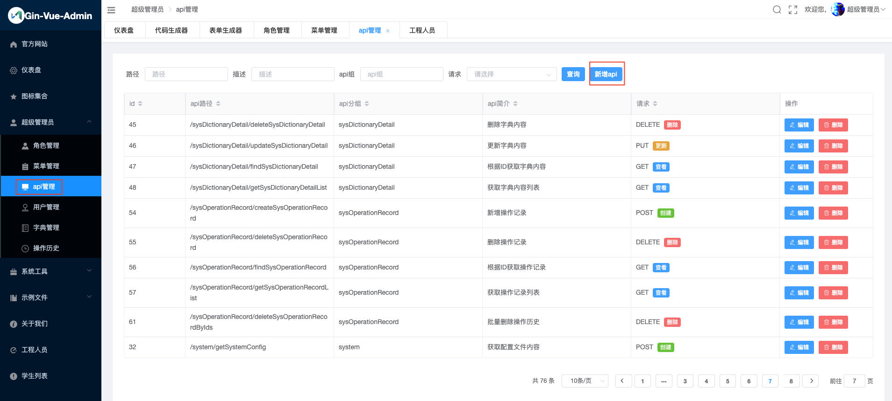
	
	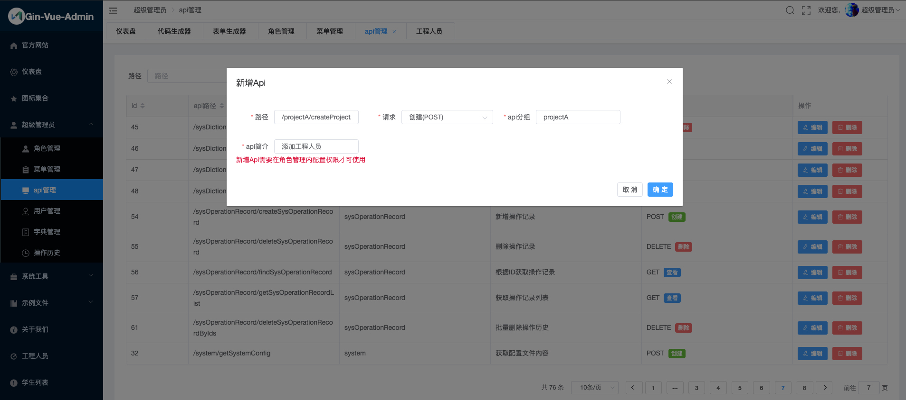
	
	* 路径：就是接口路径，比如前端项目中 `src/api/project_a.js` 每个方法里的 url
	* 请求：根据接口实际选择即可
	* api分组：对应 struct 简称
	* api简介：对api的简要说明

	> 依次完成`project_a.js`中所有url的添加

8. 进入【角色管理】页面，点击【设置权限】可以配置用户查看菜单的权限

	
	
	比如我们可以添加用户权限，允许用户查看上一步生成的菜单以及相应的api
	
	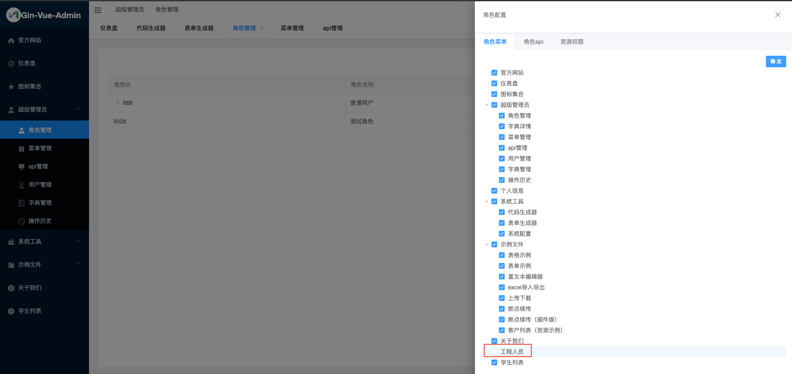
	
	
	
9. 刷新页面后即可看到新增的【工程人员】菜单，点击【新增工程人员】按钮，提示需要添加表单

	
	
10. 进入【表单生成器】页面，可以按照你所需要的类型进行表单添加和拖拽编辑

	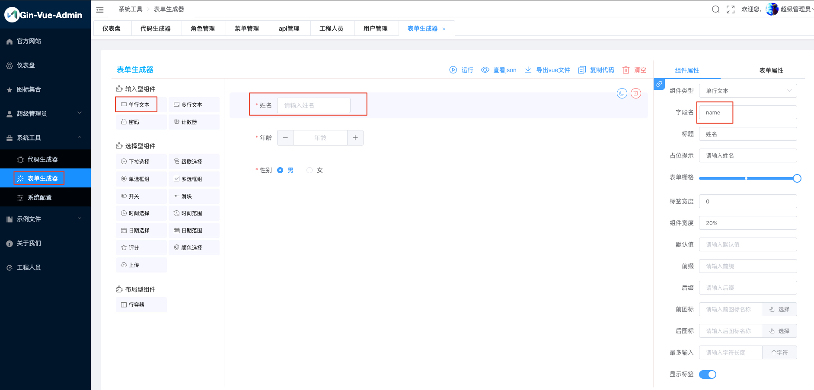
	
	年龄和性别也同样可以选择相应的组件
	
	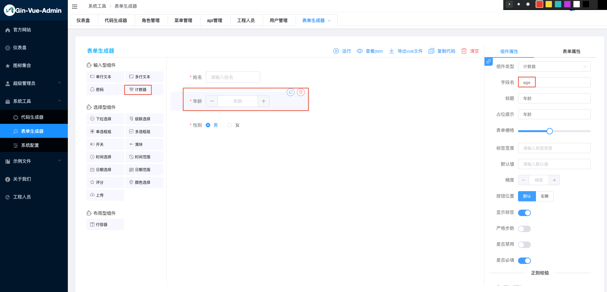
	
	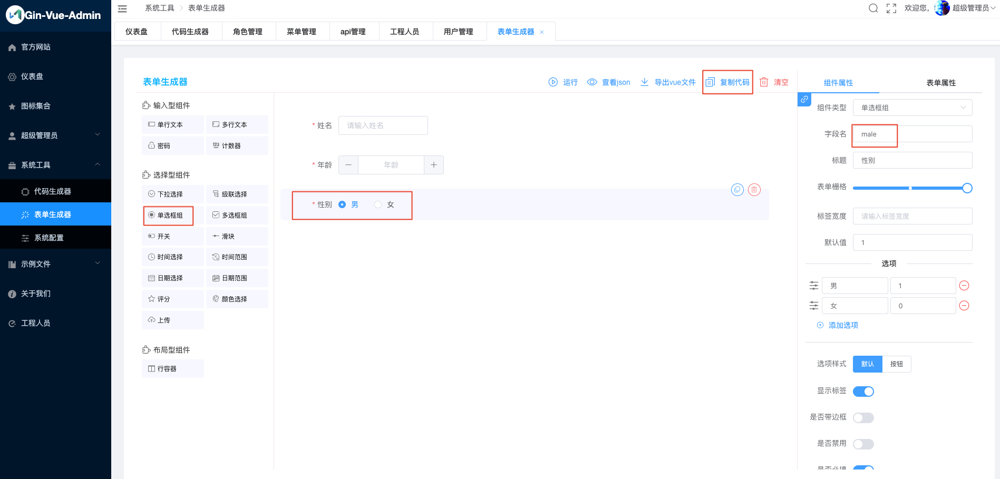
	
	完成后点击上方的【复制代码】按钮，即可copy表单代码
	
	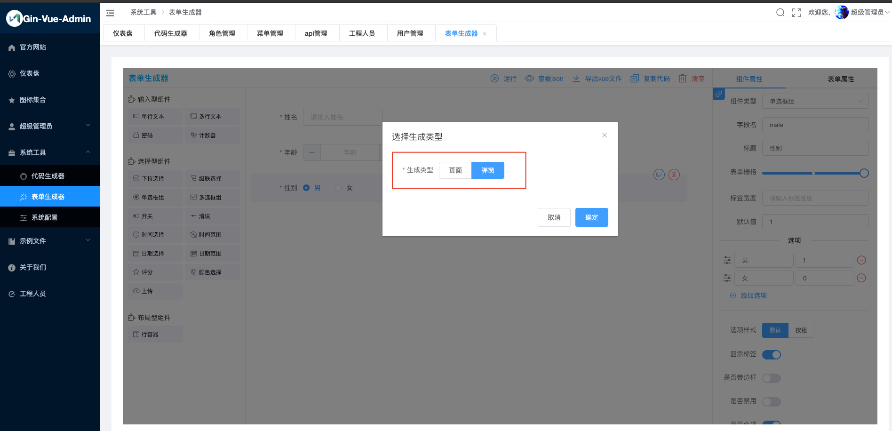
	
	选择生成类型【弹窗】，点击确定按钮
	
11. 生成的表单代码如下：

	```js
	<template>
	  <div>
	    <el-dialog v-bind="$attrs" v-on="$listeners" @open="onOpen" @close="onClose" title="Dialog Titile">
	      <el-row :gutter="15">
	        <el-form ref="elForm" :model="formData" :rules="rules" size="medium" label-width="100px">
	          <el-col :span="12">
	            <el-form-item label="姓名" prop="name">
	              <el-input v-model="formData.name" placeholder="请输入单行文本姓名" clearable :style="{width: '100%'}">
	              </el-input>
	            </el-form-item>
	          </el-col>
	          <el-col :span="24">
	            <el-form-item label="年龄" prop="age">
	              <el-input-number v-model="formData.age" placeholder="年龄"></el-input-number>
	            </el-form-item>
	          </el-col>
	          <el-col :span="24">
	            <el-form-item label="性别" prop="male">
	              <el-radio-group v-model="formData.male" size="medium">
	                <el-radio v-for="(item, index) in maleOptions" :key="index" :label="item.value"
	                  :disabled="item.disabled">{{item.label}}</el-radio>
	              </el-radio-group>
	            </el-form-item>
	          </el-col>
	        </el-form>
	      </el-row>
	      <div slot="footer">
	        <el-button @click="close">取消</el-button>
	        <el-button type="primary" @click="handelConfirm">确定</el-button>
	      </div>
	    </el-dialog>
	  </div>
	</template>
	<script>
	export default {
	  inheritAttrs: false,
	  components: {},
	  props: [],
	  data() {
	    return {
	      formData: {
	        name: undefined,
	        age: undefined,
	        male: undefined,
	      },
	      rules: {
	        name: [{
	          required: true,
	          message: '请输入单行文本姓名',
	          trigger: 'blur'
	        }],
	        age: [{
	          required: true,
	          message: '年龄',
	          trigger: 'blur'
	        }],
	        male: [{
	          required: true,
	          message: '性别不能为空',
	          trigger: 'change'
	        }],
	      },
	      // 这里的value是bool类型，需要去掉双引号
	      maleOptions: [{
	        "label": "男",
	        "value": true
	      }, {
	        "label": "女",
	        "value": false
	      }],
	    }
	  },
	  computed: {},
	  watch: {},
	  created() {},
	  mounted() {},
	  methods: {
	    onOpen() {},
	    onClose() {
	      this.$refs['elForm'].resetFields()
	    },
	    close() {
	      this.$emit('update:visible', false)
	    },
	    handelConfirm() {
	      this.$refs['elForm'].validate(valid => {
	        if (!valid) return
	        this.close()
	      })
	    },
	  }
	}
	
	</script>
	<style>
	</style>
	```
	
12. 填充表单
	* 用`<el-row>...</el-row>`之间的内容替换掉`web/src/view/project_a/project_a.vue`中的“`此处请使用表单生成器生成form填充 表单默认绑定 formData 如手动修改过请自行修改key`”这句话。

	* 在

		```js
		  data() {
		    return {
		      ...
		    };
		```
	
		中添加maleOptions的内容。
	
	* 完成后的project_a.vue文件如下:
	
		```js
		<template>
		  <div>
		    <div class="search-term">
		      <el-form :inline="true" :model="searchInfo" class="demo-form-inline">
		        <el-form-item label="姓名">
		          <el-input placeholder="搜索条件" v-model="searchInfo.name"></el-input>
		        </el-form-item>    
		            <el-form-item label="性别" prop="male">
		            <el-select v-model="searchInfo.male" clear placeholder="请选择">
		                <el-option
		                    key="true"
		                    label="男"
		                    value="true">
		                </el-option>
		                <el-option
		                    key="false"
		                    label="女"
		                    value="false">
		                </el-option>
		            </el-select>
		            </el-form-item>   
		        <el-form-item label="年龄">
		          <el-input placeholder="搜索条件" v-model="searchInfo.age"></el-input>
		        </el-form-item>    
		        <el-form-item>
		          <el-button @click="onSubmit" type="primary">查询</el-button>
		        </el-form-item>
		        <el-form-item>
		          <el-button @click="openDialog" type="primary">新增工程人员</el-button>
		        </el-form-item>
		        <el-form-item>
		          <el-popover placement="top" v-model="deleteVisible" width="160">
		            <p>确定要删除吗？</p>
		              <div style="text-align: right; margin: 0">
		                <el-button @click="deleteVisible = false" size="mini" type="text">取消</el-button>
		                <el-button @click="onDelete" size="mini" type="primary">确定</el-button>
		              </div>
		            <el-button icon="el-icon-delete" size="mini" slot="reference" type="danger">批量删除</el-button>
		          </el-popover>
		        </el-form-item>
		      </el-form>
		    </div>
		    <el-table
		      :data="tableData"
		      @selection-change="handleSelectionChange"
		      border
		      ref="multipleTable"
		      stripe
		      style="width: 100%"
		      tooltip-effect="dark"
		    >
		    <el-table-column type="selection" width="55"></el-table-column>
		    <el-table-column label="日期" width="180">
		         <template slot-scope="scope">{{scope.row.CreatedAt|formatDate}}</template>
		    </el-table-column>
		    
		    <el-table-column label="姓名" prop="name" width="120"></el-table-column> 
		    
		    <el-table-column label="性别" prop="male" width="120">
		         <template slot-scope="scope">{{scope.row.male|formatBoolean}}</template>
		    </el-table-column>
		    
		    <el-table-column label="年龄" prop="age" width="120"></el-table-column> 
		    
		      <el-table-column label="按钮组">
		        <template slot-scope="scope">
		          <el-button @click="updateProjectA(scope.row)" size="small" type="primary">变更</el-button>
		          <el-popover placement="top" width="160" v-model="scope.row.visible">
		            <p>确定要删除吗？</p>
		            <div style="text-align: right; margin: 0">
		              <el-button size="mini" type="text" @click="scope.row.visible = false">取消</el-button>
		              <el-button type="primary" size="mini" @click="deleteProjectA(scope.row)">确定</el-button>
		            </div>
		            <el-button type="danger" icon="el-icon-delete" size="mini" slot="reference">删除</el-button>
		          </el-popover>
		        </template>
		      </el-table-column>
		    </el-table>
		
		    <el-pagination
		      :current-page="page"
		      :page-size="pageSize"
		      :page-sizes="[10, 30, 50, 100]"
		      :style="{float:'right',padding:'20px'}"
		      :total="total"
		      @current-change="handleCurrentChange"
		      @size-change="handleSizeChange"
		      layout="total, sizes, prev, pager, next, jumper"
		    ></el-pagination>
		
		    <el-dialog :before-close="closeDialog" :visible.sync="dialogFormVisible" title="弹窗操作">
		      <el-row :gutter="15">
		        <el-form ref="elForm" :model="formData" :rules="rules" size="medium" label-width="100px">
		          <el-col :span="12">
		            <el-form-item label="姓名" prop="name">
		              <el-input v-model="formData.name" placeholder="请输入单行文本姓名" clearable :style="{width: '100%'}">
		              </el-input>
		            </el-form-item>
		          </el-col>
		          <el-col :span="24">
		            <el-form-item label="年龄" prop="age">
		              <el-input-number v-model="formData.age" placeholder="年龄"></el-input-number>
		            </el-form-item>
		          </el-col>
		          <el-col :span="24">
		            <el-form-item label="性别" prop="male">
		              <el-radio-group v-model="formData.male" size="medium">
		                <el-radio v-for="(item, index) in maleOptions" :key="index" :label="item.value"
		                  :disabled="item.disabled">{{item.label}}</el-radio>
		              </el-radio-group>
		            </el-form-item>
		          </el-col>
		        </el-form>
		      </el-row>
		      <div class="dialog-footer" slot="footer">
		        <el-button @click="closeDialog">取 消</el-button>
		        <el-button @click="enterDialog" type="primary">确 定</el-button>
		      </div>
		    </el-dialog>
		  </div>
		</template>
		
		<script>
		import {
		    createProjectA,
		    deleteProjectA,
		    deleteProjectAByIds,
		    updateProjectA,
		    findProjectA,
		    getProjectAList
		} from "@/api/project_a";  //  此处请自行替换地址
		import { formatTimeToStr } from "@/utils/data";
		import infoList from "@/components/mixins/infoList";
		
		export default {
		  name: "ProjectA",
		  mixins: [infoList],
		  data() {
		    return {
		      listApi: getProjectAList,
		      dialogFormVisible: false,
		      visible: false,
		      type: "",
		      deleteVisible: false,
		      multipleSelection: [],formData: {
		        name:null,male:null,age:null,
		      },
			  maleOptions: [{
			    "label": "男",
			    "value": true
			  }, {
			    "label": "女",
			    "value": false
			  }],
		    };
		  },
		  filters: {
		    formatDate: function(time) {
		      if (time != null && time != "") {
		        var date = new Date(time);
		        return formatTimeToStr(date, "yyyy-MM-dd hh:mm:ss");
		      } else {
		        return "";
		      }
		    },
		    formatBoolean: function(bool) {
		      if (bool != null) {
		        return bool ? "男" :"女";
		      } else {
		        return "";
		      }
		    }
		  },
		  methods: {
		      //条件搜索前端看此方法
		      onSubmit() {
		        this.page = 1
		        this.pageSize = 10       
		        if (this.searchInfo.male==""){
		          this.searchInfo.male=null
		        }       
		        this.getTableData()
		      },
		      handleSelectionChange(val) {
		        this.multipleSelection = val
		      },
		      async onDelete() {
		        const ids = []
		        this.multipleSelection &&
		          this.multipleSelection.map(item => {
		            ids.push(item.ID)
		          })
		        const res = await deleteProjectAByIds({ ids })
		        if (res.code == 0) {
		          this.$message({
		            type: 'success',
		            message: '删除成功'
		          })
		          this.deleteVisible = false
		          this.getTableData()
		        }
		      },
		    async updateProjectA(row) {
		      const res = await findProjectA({ ID: row.ID });
		      this.type = "update";
		      if (res.code == 0) {
		        this.formData = res.data.reprojectA;
		        this.dialogFormVisible = true;
		      }
		    },
		    closeDialog() {
		      this.dialogFormVisible = false;
		      this.formData = {
		        
		          name:null,
		          male:null,
		          age:null,
		      };
		    },
		    async deleteProjectA(row) {
		      this.visible = false;
		      const res = await deleteProjectA({ ID: row.ID });
		      if (res.code == 0) {
		        this.$message({
		          type: "success",
		          message: "删除成功"
		        });
		        this.getTableData();
		      }
		    },
		    async enterDialog() {
		      let res;
		      switch (this.type) {
		        case "create":
		          res = await createProjectA(this.formData);
		          break;
		        case "update":
		          res = await updateProjectA(this.formData);
		          break;
		        default:
		          res = await createProjectA(this.formData);
		          break;
		      }
		      if (res.code == 0) {
		        this.$message({
		          type:"success",
		          message:"创建/更改成功"
		        })
		        this.closeDialog();
		        this.getTableData();
		      }
		    },
		    openDialog() {
		      this.type = "create";
		      this.dialogFormVisible = true;
		    }
		  },
		  async created() {
		    await this.getTableData();}
		};
		</script>
		
		<style>
		</style>
		```

14. 在【工程人员】页面，可以使用表单进行增删改查

	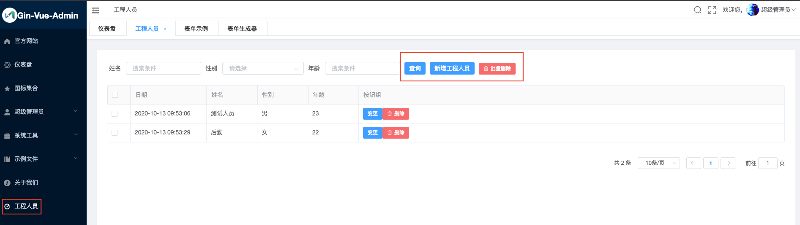

15. 表单提交的数据会入库到ProjectA表中

	```js
	> select * from ProjectA;
	+----+---------------------+---------------------+------------+----------+------+-----+
	| id | created_at          | updated_at          | deleted_at | name     | male | age |
	+----+---------------------+---------------------+------------+----------+------+-----+
	| 27 | 2020-10-13 09:53:06 | 2020-10-13 09:53:06 | <null>     | 测试人员  | 1    | 23  |
	| 28 | 2020-10-13 09:53:29 | 2020-10-13 09:53:29 | <null>     | 后勤     | 0    | 22  |
	+----+---------------------+---------------------+------------+----------+------+-----+
	```
