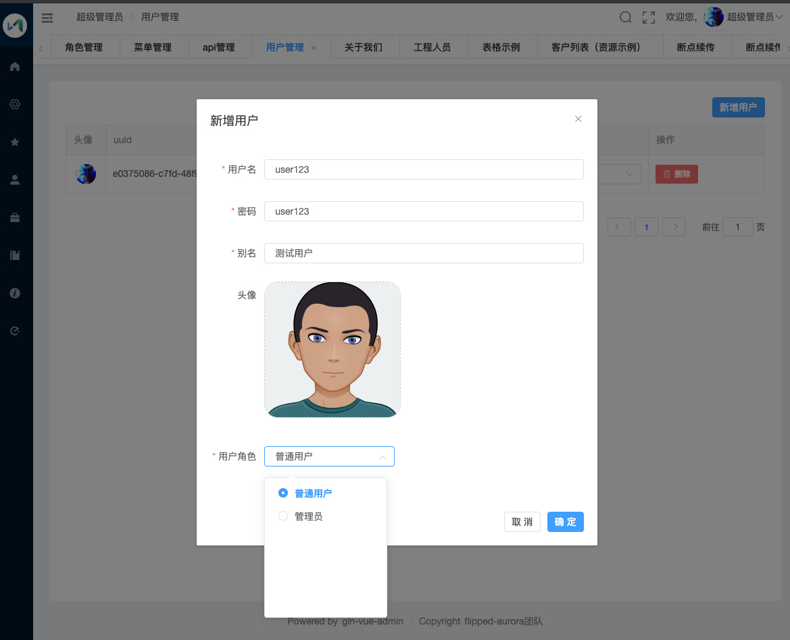
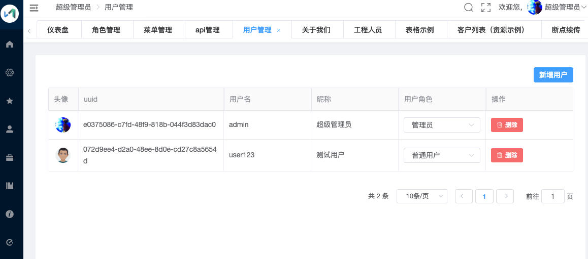
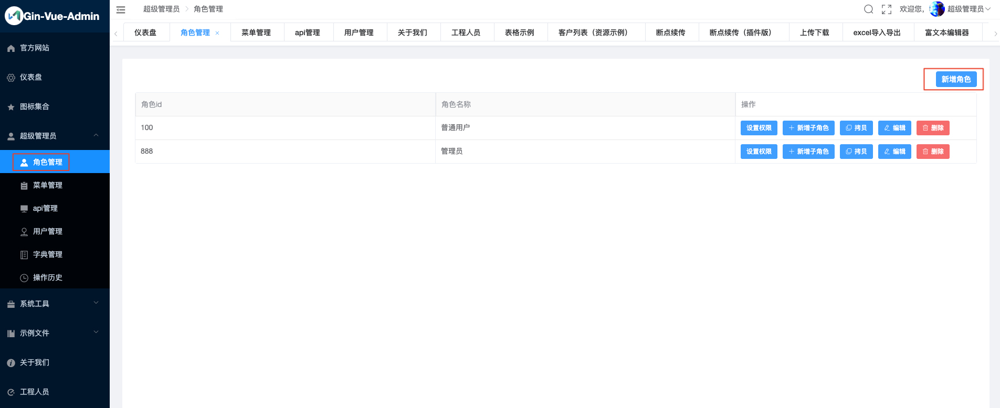
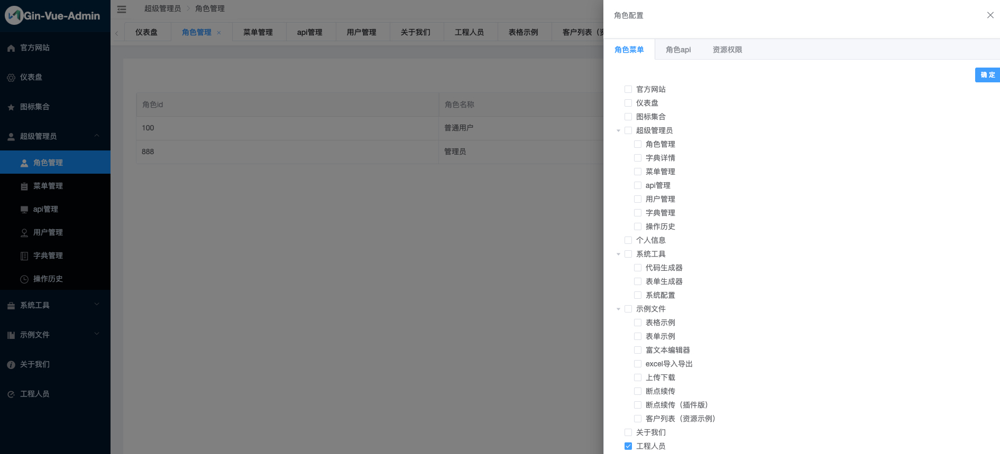
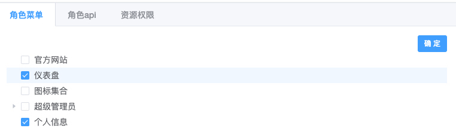
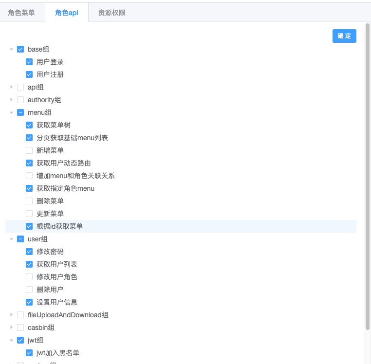
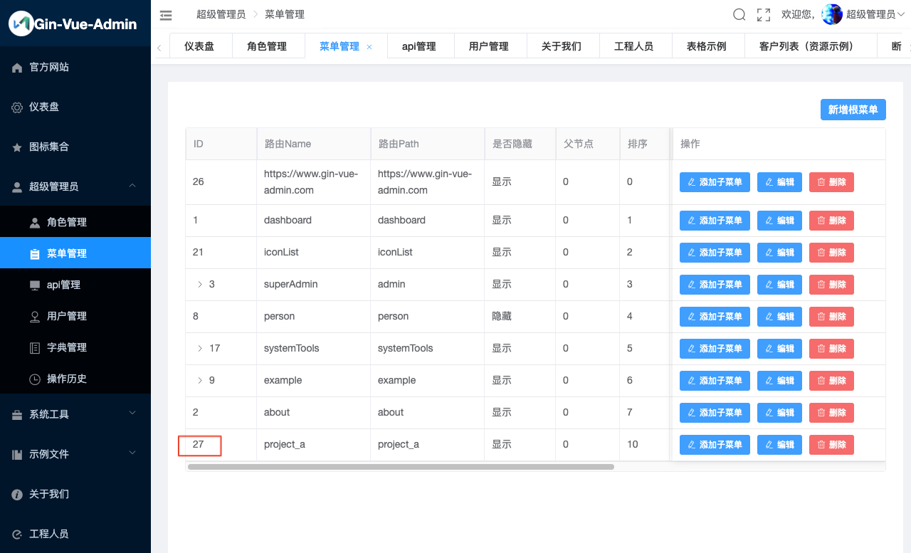

#### <font color="blue">用户管理</font>

---

# 添加用户


在【用户管理】页面可以进行用户的增删改查，点击【新增用户】可以添加用户 



点击【确定】后可以完成用户新增



## 后台底层逻辑

* 注册用户时调用的是后台的`/base/register`接口(POST)

	> 代码位置：`server/api/v1/sys_user.go`
	>
	>  页面实际访问的是`http://localhost:8080/api/base/register`，通过前端路由，将8080端口`/api`前缀的请求转发至后台的 8888 端口服务
	
* 添加完成的用户会入库至`sys_users`表中

	```js
	+----+---------------------+---------------------+------------+--------------------------------------+----------+----------------------------------+-----------+-------------------------------------------------------+--------------+
| id | created_at          | updated_at          | deleted_at | uuid                                 | username | password                         | nick_name | header_img                                            | authority_id |
+----+---------------------+---------------------+------------+--------------------------------------+----------+----------------------------------+-----------+-------------------------------------------------------+--------------+
| 3  | 2020-10-14 19:49:34 | 2020-10-14 19:49:34 | <null>     | 072d9ee4-d2a0-48ee-8d0e-cd27c8a5654d | user123  | 6ad14ba9986e3615423dfca256d04e3f | 测试用户  | http://qmplusimg.henrongyi.top/1576554439myAvatar.png | 100          |
+----+---------------------+---------------------+------------+--------------------------------------+----------+----------------------------------+-----------+-------------------------------------------------------+--------------+
	```
	
	* 程序会生成一个唯一的uuid
	* 后台入库前会对password做md5加密处理
	* authority_id为角色权限号，详见【2. 角色权限管理】

# 角色权限管理

在【角色管理】页面可以进行角色权限管理



点击【新增角色】可以添加角色


这里的【角色ID】为角色权限号



点击角色后面的【设置权限】按钮，可以设定角色允许访问的菜单、api和资源

> 注意角色需要添加以下权限，否则会影响正常登录





## 后台底层逻辑

### 新增角色

* 新增角色时调用的是后台的`/authority/createAuthority`接口(POST)

	> 代码位置: `server/api/v1/sys_authority.go`
	
* 添加完成后的角色会入库至`sys_authorities`表中

	```js
	+---------------------+---------------------+------------+--------------+----------------+-----------+
| created_at          | updated_at          | deleted_at | authority_id | authority_name | parent_id |
+---------------------+---------------------+------------+--------------+----------------+-----------+
| 2020-10-14 19:48:03 | 2020-10-14 19:48:03 | <null>     | 100          | 普通用户       | 0         |
+---------------------+---------------------+------------+--------------+----------------+-----------+
	```

	* 用户和角色权限之间通过authority_id来关联

### 设置权限 —— 菜单

* 设置菜单权限时调用的是后台的`/authority/setDataAuthority`接口(POST)

	> 代码位置: `server/api/v1/sys_authority.go`
	
* 设置完成后会更新`sys_authority_menus`表

	```js
	+------------------+----------------------------+
	| sys_base_menu_id | sys_authority_authority_id |
	+------------------+----------------------------+
	| 27               | 100                        |
	+------------------+----------------------------+
	```
	
	* `sys_base_menu_id`为菜单id，表示该角色允许访问的菜单

		
		
	* `sys_authority_authority_id`为角色权限号，和`sys_authorities`表的`authority_id`相关联
	* 程序会根据 基础菜单表(`sys_base_menus`), 和`sys_authority_menus` 创建一个视图：`authority_menu`

		```js
		+----+---------------------+---------------------+------------+------------+-----------+-----------+-----------+--------+------------------------------+----------+-------+------+--------------+---------+------------+--------------+
| id | created_at          | updated_at          | deleted_at | menu_level | parent_id | path      | name      | hidden | component                    | title    | icon  | sort | authority_id | menu_id | keep_alive | default_menu |
+----+---------------------+---------------------+------------+------------+-----------+-----------+-----------+--------+------------------------------+----------+-------+------+--------------+---------+------------+--------------+
| 27 | 2020-10-12 22:11:03 | 2020-10-12 22:11:03 | <null>     | 0          | 0         | project_a | project_a | 0      | view/project_a/project_a.vue | 工程人员 | eleme | 10   | 100          | 27      | 0          | 0            |
+----+---------------------+---------------------+------------+------------+-----------+-----------+-----------+--------+------------------------------+----------+-------+------+--------------+---------+------------+--------------+
		```
		
### 设置权限 —— api

* 设置api权限时调用的是后台的`/casbin/updateCasbin`接口(POST)
	
	> 代码位置：`server/api/v1/sys_casbin.go`
	
* 设置完成后会更新`casbin_rule`表

	```js
	+--------+-----+-------------------------------+--------+----+----+----+
	| p_type | v0  | v1                            | v2     | v3 | v4 | v5 |
	+--------+-----+-------------------------------+--------+----+----+----+
	| p      | 100 | /projectA/createProjectA      | POST   |    |    |    |
	| p      | 100 | /projectA/deleteProjectA      | DELETE |    |    |    |
	| p      | 100 | /projectA/deleteProjectAByIds | DELETE |    |    |    |
	| p      | 100 | /projectA/updateProjectA      | PUT    |    |    |    |
	| p      | 100 | /projectA/findProjectA        | GET    |    |    |    |
	| p      | 100 | /projectA/getProjectAList     | GET    |    |    |    |
	+--------+-----+-------------------------------+--------+----+----+----+
	```
	
	* 内容为`authority_id` = 100 允许访问的接口

### 设置权限 —— 资源