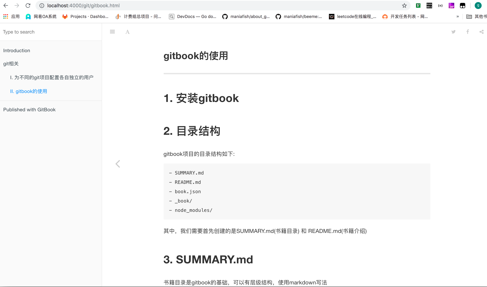
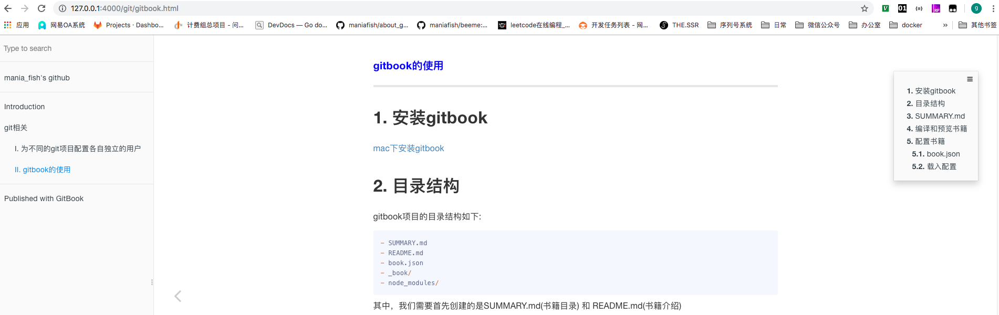

#### <font color="blue">gitbook的使用

---

# 安装gitbook

[mac下安装gitbook](https://www.jianshu.com/p/9f24f8e27fc6)

# 目录结构

gitbook项目的目录结构如下:

```javascript
- SUMMARY.md
- README.md
- book.json
- _book/
- node_modules/
```

其中，我们需要首先创建的是SUMMARY.md(书籍目录) 和 README.md(书籍介绍)

# SUMMARY.md

书籍目录是gitbook的基础，可以有层级结构，使用markdown写法

```javascript
# Summary

* [Introduction](README.md)
* [git相关](git.md)
    * [I. 为不同的git项目配置各自独立的用户](./git/user.md)
    * [II. gitbook的使用](./git/gitbook.md)
    ...
```

# 编译和预览书籍

书籍目录和目录中链接的内容(\*.md)文件编辑完成后，执行`gitbook serve`即可完成书籍的编译

```javascript
$ gitbook serve

Live reload server started on port: 35729
Press CTRL+C to quit ...

info: 7 plugins are installed
info: loading plugin "livereload"... OK
info: loading plugin "highlight"... OK
info: loading plugin "search"... OK
info: loading plugin "lunr"... OK
info: loading plugin "sharing"... OK
info: loading plugin "fontsettings"... OK
info: loading plugin "theme-default"... OK
info: found 4 pages
info: found 1 asset files
info: >> generation finished with success in 0.7s !

Starting server ...
Serving book on http://localhost:4000
```
按照提示信息，访问本机4000端口，即可看到预览结果



执行完成后，会在项目下自动生成书籍的文件目录\_book/

# 配置书籍

## book.json

在项目目录下新建book.json文件，可以进行书籍配置；book.json示例如下:

```javascript
{
    "author": "mania_fish<mania_fish@163.com>",
    "description": "How to build effective golang project",
    "extension": null,
    "generator": "site",
    "links": {
        "sharing": {
            "all": null,
            "facebook": null,
            "google": null,
            "twitter": null,
            "weibo": null
        },
        "sidebar": {
            "mania_fish's github": "https://github.com/maniafish"
        }
    },
    "output": null,
    "pdf": {
        "fontSize": 12,
        "footerTemplate": null,
        "headerTemplate": null,
        "margin": {
            "bottom": 36,
            "left": 62,
            "right": 62,
            "top": 36
        },
        "pageNumbers": false,
        "paperSize": "a4"
    },
    "plugins": [
        "-lunr",
        "-search",
        "search-pro",
        "anchor-navigation-ex",
        "splitter",
        "sectionx",
        "prism",
        "-highlight",
        "prism-themes"
    ],
    "title": "real effective go",
    "variables": {},
    "pluginsConfig": {
        "anchor-navigation-ex": {
            "isShowTocTitleIcon": true,
            "tocLevel2Icon": "fa fa-hand-o-right",
            "tocLevel3Icon": "fa fa-hand-o-right",
            "tocLevel4Icon": "fa fa-hand-o-right"
        },
        "prism": {
            "css": [
                "prism-themes/themes/prism-base16-ateliersulphurpool.light.css"
            ],
            "lang": {
                "flow": "typescript"
            },
            "ignore": [
                "mermaid",
                "eval-js"
            ]
        }
    }
}
```

* [官方配置字段说明](https://toolchain.gitbook.com/config.html)
* 插件plugins
    * "-lunr", "-search", "search-pro": 禁用掉gitbook默认的搜索插件，使用[search-pro](https://plugins.gitbook.com/plugin/search-pro), 支持中文搜索
    * ["anchor-navigation-ex"](https://plugins.gitbook.com/plugin/anchor-navigation-ex): 页面章节锚点
        > 由于前三级的标题会被自动锚点并编号，为了文章标题不被锚点，我们采用如下格式:
        
        ```javascript
        #### <font color="blue">标题

        ---

        # 文章第一节
        ## 文章第一节的第一小节
        ```

        效果如下:
        
        

    * "-highlight", "prism", "prism-themes": 禁用原代码高亮功能，使用[prism代码主题](https://github.com/gaearon/gitbook-plugin-prism)
    * 更多插件，详见[官网](https://plugins.gitbook.com/)

## 载入配置

* 在项目目录下执行`gitbook install`即可安装配置插件；安装完成后，项目下会出现一个node_modules/目录
* 然后执行`gitbook serve`即可看到配置完成后的主页

# 集成发布到github pages

1. 在项目目录下执行`git init`新建git仓库
1. `git remote add origin <远端github仓库地址>` 添加github仓库
1. `git checkout --orphan gh-pages` 创建孤儿分支gh-pages

> 参考链接：
> 
> [gitbook简明教程](http://www.chengweiyang.cn/gitbook/basic-usage/README.html)
