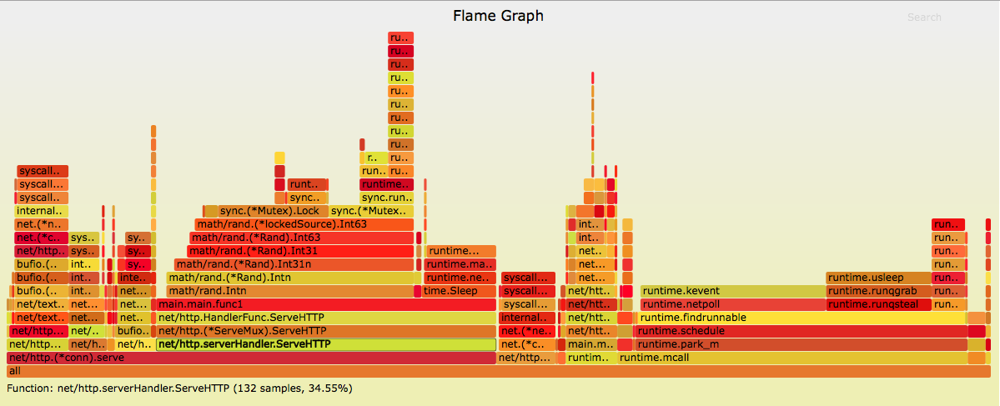

#### <font color="blue">Go代码调优利器pprof + go-torch</font>

---

# pprof的使用

如何分析我们golang服务端代码的运行性能，并且找到程序的性能瓶颈和优化点呢？golang提供了pprof工具来帮助我们分析cpu、堆栈、goroutine、锁占用等程序运行信息。简单的使用教程可以参考：[Golang 大杀器之性能剖析 PProf](./pprof.md)

* 对于golang的http server应用，如果使用的是默认的http handler，只需要`import _ "net/http/pprof"`；pprof会自动在你的http server上注册以下接口:

	* /debug/pprof/
	* /debug/pprof/cmdline
	* /debug/pprof/profile
	* /debug/pprof/symbol
	* /debug/pprof/trace

* 若你使用的是其他的第三方库进行路由注册，如`github.com/gorilla/mux`，就需要自行注册pprof接口:

	```js
	import (
	    "github.com/gorilla/mux"
	    "net/http/pprof"
	)
	
	func AttachProfiler(router *mux.Router) {
	    router.HandleFunc("/debug/pprof/", pprof.Index)
	    router.HandleFunc("/debug/pprof/cmdline", pprof.Cmdline)
	    router.HandleFunc("/debug/pprof/profile", pprof.Profile)
	    router.HandleFunc("/debug/pprof/symbol", pprof.Symbol)
	}
	```

# go-torch的使用

pprof可以为我们提供基本的性能分析图，如果需要更加直观的可视化性能调优，可以使用第三方火焰图工具go-torch

1. 安装Flame Graph

	```js
	git clone https://github.com/brendangregg/FlameGraph.git
	cp FlameGraph/flamegraph.pl /usr/local/bin
	```
	
2. 安装go-torch

	```js
	go get -v github.com/uber/go-torch
	```
	
3. 使用go-torch分析程序代码，比如以下这段服务器代码：

	```js
	package main
	
	import (
		"log"
		"math/rand"
		"net/http"
		_ "net/http/pprof"
		"time"
	)
	
	// base64使用的字符集
	const letterBytes = "abcdefghijklmnopqrstuvwxyzABCDEFGHIJKLMNOPQRSTUVWXYZ0123456789/+="
	
	func main() {
		handler := func(w http.ResponseWriter, req *http.Request) {
			body := make([]byte, 2048)
			for i := range body {
				body[i] = letterBytes[rand.Intn(len(letterBytes))]
			}
	
			time.Sleep(100 * time.MillisecondSecond)
			w.Write(body)
		}
	
		http.HandleFunc("/random_bytes", handler)
		log.Fatal(http.ListenAndServe(":8080", nil))
	}
	```
	
	> 这段代码的功能很简单，就是访问`127.0.0.1:8080/random_bytes`接口，100毫秒后返回长度为2048的随机字符串
	
4. 执行`go run main.go`运行程序后，使用ab工具持续压测接口

	```js
	$ ab -n10000 -c 20 '127.0.0.1:8080/random_bytes'
	```
5. 于此同时，通过go-torch获取性能分析数据，采样时间为30秒，采样结果输出到main.svg文件中

	```js
	$ go-torch -u http://127.0.0.1:8080/debug/pprof/profile -t 30 -f main.svg
	```
	
6. 采样完成后，打开main.svg即可看到分析结果，横轴的宽度表示当前方法运行时间占总时间的百分比

	
	
> 参考链接:
> 
> * [go-torch官网](https://github.com/uber-archive/go-torch)
> * [Flame Graphs](https://github.com/brendangregg/FlameGraph)
> * [代码调优利器-火焰图](https://lihaoquan.me/2017/1/1/Profiling-and-Optimizing-Go-using-go-torch.html)