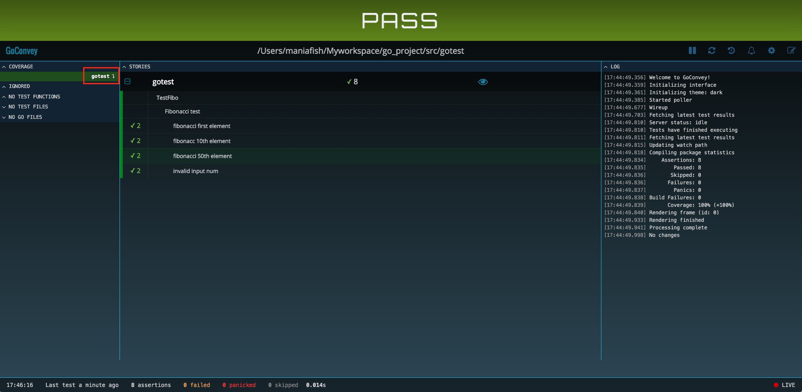

#### <font color="blue">Go程序基准测试</font>

---

golang自带了程序单元测试工具`go test`，可以用来做程序的单元测试和性能测试，简单的使用教程可以参考: [golang 编写测试用例](https://github.com/astaxie/build-web-application-with-golang/blob/master/zh/11.3.md)

# 高效优雅地编写测试用例

这里推荐一个用于编写golang测试用例的第三方库：[goconvey](https://github.com/smartystreets/goconvey)。  
goconvey是一款针对Golang的测试框架，可以管理和运行测试用例，同时提供了丰富的断言函数，并支持很多 Web 界面特性。

## goconvey实践

1. 通过`go get github.com/smartystreets/goconvey`即可完成安装
2. 一个简单的狄波拉契序列的栗子，源码`fibo.go`如下

	```js
	package gotest
	
	import (
		"errors"
	)
	
	// fibonacci 斐波那契闭包
	func fibonacci() func() int {
		a, b := 0, 1
		return func() int {
			a, b = b, a+b
			return a
		}
	}
	
	// Fibo 返回斐波那契序列的第n个元素
	func Fibo(n int) (int, error) {
		if n < 1 {
			return 0, errors.New("invalid n")
		}
	
		f, res := fibonacci(), 0
		for i := 0; i < n; i++ {
			res = f()
		}
	
		return res, nil
	}
	```
	
3. 测试代码`fibo_test.go`如下

	```js
	package gotest
	
	import (
		"testing"
	
		. "github.com/smartystreets/goconvey/convey"
	)
	
	func TestFibo(t *testing.T) {
		Convey("Fibonacci test\n", t, func() {
			Convey("fibonacci first element\n", func() {
				res, err := Fibo(1)
				So(res, ShouldEqual, 1)
				So(err, ShouldBeNil)
			})
	
			Convey("fibonacc 10th element\n", func() {
				res, err := Fibo(10)
				So(res, ShouldEqual, 55)
				So(err, ShouldBeNil)
			})
	
			Convey("fibonacci 50th element\n", func() {
				res, err := Fibo(50)
				So(res, ShouldEqual, 12586269025)
				So(err, ShouldBeNil)
			})
	
			Convey("invalid input num\n", func() {
				_, err := Fibo(0)
				So(err, ShouldNotBeNil)
				_, err = Fibo(-1)
				So(err, ShouldNotBeNil)
			})
		})
	}
	```

4. 在项目目录下执行`goconvey`，会在页面输出测试结果

	
	
	* 可以看到，这里有四个测试用例，每个用例有两个断言，断言成功会打勾(错误会打叉)；所有断言成功执行则测试用例“pass”
	* goconvey提供的断言名称都十分直观，比如"ShouldBeNil", "ShouldNotEqual"等，完整的断言定义可以参考[assertions.go](https://github.com/smartystreets/goconvey/blob/master/convey/assertions.go)
	* 这个页面在执行`goconvey`命令后会自动弹出，也可以通过`http://127.0.0.1:8080/`访问到
	* 红框标识的部分是本次单元测试的包，点击可以看到这个包内代码的覆盖率情况，显示页面如下

		
	
# Go基准测试选项

推荐的golang基准测试指令:

```js
go test -bench="BenchmarkLogger" -benchtime=3s -run=none -cpuprofile=cpu.prof 
```

* -bench: 执行哪些基准测试方法

	* 这里是执行所有匹配了"BenchmarkLogger"的基准测试方法
	* 如果希望执行包内所有的基准测试方法，则设置`-bench=.`即可
	* 支持正则表达式，如`^BenchmarkLogger$`，就能唯一定位到`BenchmarkLogger`方法

* -benchtime: 执行每个基准测试方法的时间，默认为1s，一般不超过3s
* -run: 执行哪些单元测试用例

	* `-run=none`表示只执行基准测试，不执行单元测试用例

* -cpuprofile: 生成用于做性能分析的cpu profile文件，具体分析方法可以参考: [Go代码调优利器pprof + go-torch](./go-torch.md)
