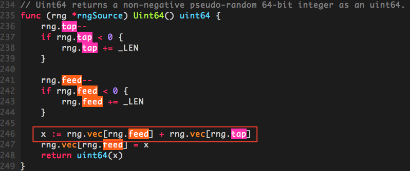
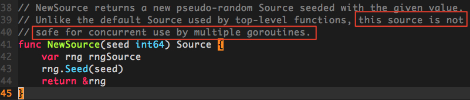

#### <font color="blue">Go随机数生成的并发安全问题</font>

---

# 问题分析

golang中的随机数生成是由官方包`math/rand`来处理的，使用方法很简单：

```js
package main

import (
	"fmt"
	"math/rand"
	"time"
)

func main() {
	// 使用当前的纳秒时间作为随机因子，生成一个rand对象
	r := rand.New(rand.NewSource(time.Now().UnixNano()))
	// 生成100以内的随机数
	fmt.Println(r.Intn(100))
}
```

在实际的使用场景中，我们经常会碰到需要重复生成随机数的情况。最常见的就是，在调用某个方法A时，在A的逻辑中需要用到一个范围内的随机数，我们就在A方法中采用`r.Intn(n)`生成这样一个随机数；由于每次调用A时，都要使用rand对象`r`来生成一个随机数，因此我们通常会对这个rand对象做提前定义，以免每次生成随机数都要重复创建对象造成不必要的开销。

```js
package main

import (
	"math/rand"
	"time"
)

var Rand = rand.New(rand.NewSource(time.Now().UnixNano()))

func A() {
	...
	p := Rand.Intn(n)
	...
}

func main() {
	...
	A()
	...
}
```

这种做法在平时单协程内做随机数生成时没有任何问题，但是一旦碰到高并发的情况，问题就来了。我们来看下面这段服务器代码。

```js
package main

import (
    "log"
    "math/rand"
    "net/http"
    "time"
)

// base64使用的字符集
const letterBytes = "abcdefghijklmnopqrstuvwxyzABCDEFGHIJKLMNOPQRSTUVWXYZ0123456789/+="

var letterRand = rand.New(rand.NewSource(time.Now().UnixNano()))

func main() {
    handler := func(w http.ResponseWriter, req *http.Request) {
        body := make([]byte, 1024)
        for i := range body {
            body[i] = letterBytes[letterRand.Intn(len(letterBytes))]
        }

        w.Write(body)
    }

    http.HandleFunc("/random_bytes", handler)
    log.Fatal(http.ListenAndServe(":8080", nil))
}
```

这段代码的功能是返回长度为1k的随机base64字符串，接下来，我们通过ab压测工具来并发访问一下这个接口

```js
$ ab -n 10000 -c 100 '127.0.0.1:8080/random_bytes'                                                                                                   
This is ApacheBench, Version 2.3 <$Revision: 1807734 $>
Copyright 1996 Adam Twiss, Zeus Technology Ltd, http://www.zeustech.net/
Licensed to The Apache Software Foundation, http://www.apache.org/

Benchmarking 127.0.0.1 (be patient)
Completed 1000 requests
Completed 2000 requests
Completed 3000 requests
Completed 4000 requests
Completed 5000 requests
Completed 6000 requests
Completed 7000 requests
Completed 8000 requests
Completed 9000 requests
Completed 10000 requests
Finished 10000 requests


Server Software:
Server Hostname:        127.0.0.1
Server Port:            8080

Document Path:          /random_bytes
Document Length:        1024 bytes

Concurrency Level:      100
Time taken for tests:   1.240 seconds
Complete requests:      10000
Failed requests:        94
   (Connect: 0, Receive: 0, Length: 94, Exceptions: 0)
Total transferred:      11322542 bytes
HTML transferred:       10143744 bytes
Requests per second:    8063.88 [#/sec] (mean)
Time per request:       12.401 [ms] (mean)
Time per request:       0.124 [ms] (mean, across all concurrent requests)
Transfer rate:          8916.37 [Kbytes/sec] received

Connection Times (ms)
              min  mean[+/-sd] median   max
Connect:        0    5   2.3      5      15
Processing:     0    7   3.7      6      36
Waiting:        0    5   3.7      5      36
Total:          1   12   3.6     12      38

Percentage of the requests served within a certain time (ms)
  50%     12
  66%     13
  75%     13
  80%     14
  90%     16
  95%     18
  98%     22
  99%     27
 100%     38 (longest request)
```

这里我们设定的是100并发，共10000个请求，可以看到，其中有94个请求都失败了。

```js
Failed requests:        94
```

检查服务端输出，发现抛出了panic

```js
http: panic serving 127.0.0.1:57330: runtime error: index out of range
goroutine 19898 [running]:
net/http.(*conn).serve.func1(0xc42054c320)
	/go/src/net/http/server.go:1697 +0xd0
panic(0x1250aa0, 0x13f9e20)
	/go/src/runtime/panic.go:491 +0x283
math/rand.(*rngSource).Uint64(...)
	/go/src/math/rand/rng.go:246
math/rand.(*rngSource).Int63(0xc420097500, 0xf67aee49c000000)
	/go/src/math/rand/rng.go:231 +0x8a
math/rand.(*Rand).Int63(0xc42007cbd0, 0xf67aee49c000000)
	/go/src/math/rand/rand.go:82 +0x33
math/rand.(*Rand).Int31(0xc42007cbd0, 0xf67aee4)
	/go/src/math/rand/rand.go:96 +0x2b
math/rand.(*Rand).Int31n(0xc42007cbd0, 0xc400000041, 0xc400000019)
	/go/src/math/rand/rand.go:131 +0x4f
math/rand.(*Rand).Intn(0xc42007cbd0, 0x41, 0x19)
	/go/src/math/rand/rand.go:145 +0x45
main.main.func1(0x13d0da0, 0xc420561260, 0xc4203d8d00)
	/go_project/src/test/test_server/main.go:19 +0xaf
net/http.HandlerFunc.ServeHTTP(0x12af8a0, 0x13d0da0, 0xc420561260, 0xc4203d8d00)
	/go/src/net/http/server.go:1918 +0x44
net/http.(*ServeMux).ServeHTTP(0x1403920, 0x13d0da0, 0xc420561260, 0xc4203d8d00)
	/go/src/net/http/server.go:2254 +0x130
net/http.serverHandler.ServeHTTP(0xc420082dd0, 0x13d0da0, 0xc420561260, 0xc4203d8d00)
	/go/src/net/http/server.go:2619 +0xb4
net/http.(*conn).serve(0xc42054c320, 0x13d1220, 0xc42027c800)
	/go/src/net/http/server.go:1801 +0x71d
created by net/http.(*Server).Serve
	/go/src/net/http/server.go:2720 +0x288
```

根据报错信息，我们可以定位到panic位置在官方包`math/rand/rng.go: func (rng *rngSource) Uint64() uint64`方法的以下行：



实际上rand包在生成随机数时，底层都是通过上面这个方法，从`vec`数组中取出int64元素来进行计算，返回一个伪随机数的。这个方法中对数组的两个索引值`tap`和`feed`，都存在着一个递减到0以下时增加`_LEN`值的非原子操作。

也就是说，在并发环境下，如果其中一个协程A对`tap`(或`feed`)递减到0以下，在重设`tap`(或`feed`)前，协程B同时在进行以下操作

```
x := rng.vec[rng.feed] + rng.vec[rng.tap]
rng.vec[rng.feed] = x
```

就会因为取数组的索引为负数(如`vec[-1]`)，导致panic。

# 全局rand对象

我们在生成rand对象时使用的NewSource()方法，在官方包里有明确注释说明，使用该方法返回的对象是非协程安全的



事实上，官方的rand包里提供了一个全局的rand对象`var globalRand = New(&lockedSource{src: NewSource(1).(Source64)})`，这个对象使用的是`lockedSource`，通过加锁来保证随机数生成时的协程安全。在使用时，直接通过`rand.Intn(n)`调用官方包方法，默认就会使用这个`globalRand`对象来生成随机数。

我们将之前服务端生成随机字符串的那行代码改为

```js
body[i] = letterBytes[rand.Intn(len(letterBytes))]
```

使用官方包的全局rand对象来生成随机数，然后通过ab压测看一下效果

```js
$ ab -n 10000 -c 100 '127.0.0.1:8080/random_bytes'                                                                                                   
This is ApacheBench, Version 2.3 <$Revision: 1807734 $>
Copyright 1996 Adam Twiss, Zeus Technology Ltd, http://www.zeustech.net/
Licensed to The Apache Software Foundation, http://www.apache.org/

Benchmarking 127.0.0.1 (be patient)
apr_socket_recv: Connection refused (61)
maniafish:tech_talk/ (master✗) $ ab -n 10000 -c 100 '127.0.0.1:8080/random_bytes'                                                                                                   
This is ApacheBench, Version 2.3 <$Revision: 1807734 $>
Copyright 1996 Adam Twiss, Zeus Technology Ltd, http://www.zeustech.net/
Licensed to The Apache Software Foundation, http://www.apache.org/

Benchmarking 127.0.0.1 (be patient)
Completed 1000 requests
Completed 2000 requests
Completed 3000 requests
Completed 4000 requests
Completed 5000 requests
Completed 6000 requests
Completed 7000 requests
Completed 8000 requests
Completed 9000 requests
Completed 10000 requests
Finished 10000 requests


Server Software:
Server Hostname:        127.0.0.1
Server Port:            8080

Document Path:          /random_bytes
Document Length:        1024 bytes

Concurrency Level:      100
Time taken for tests:   7.892 seconds
Complete requests:      10000
Failed requests:        0
Total transferred:      11429968 bytes
HTML transferred:       10240000 bytes
Requests per second:    1267.06 [#/sec] (mean)
Time per request:       78.923 [ms] (mean)
Time per request:       0.789 [ms] (mean, across all concurrent requests)
Transfer rate:          1414.30 [Kbytes/sec] received

Connection Times (ms)
              min  mean[+/-sd] median   max
Connect:        0   50 297.4     16    2958
Processing:     0   28  55.7     22     923
Waiting:        0   22  54.0     18     914
Total:          1   78 302.0     38    2991

Percentage of the requests served within a certain time (ms)
  50%     38
  66%     43
  75%     46
  80%     48
  90%     57
  95%     78
  98%    888
  99%   2927
 100%   2991 (longest request)
```

可以看到，现在没有失败的请求了

```js
Complete requests:      10000
Failed requests:        0
```

但是使用全局rand对象有一个问题，由于全局对象使用的随机因子固定是1，因此每次重启服务器后，顺序生成的随机对象都会是一样的。

以上面那段服务端代码为例，每次重启程序后，访问返回的随机字符串都是：

```js
$ curl '127.0.0.1:8080/random_bytes'                                                                                                                 
KVLoZ6Oavp=40jWjUThPTPHn/h/x3fqn5PyFwFOPxOessrsjXCLqNjOOCsn8lTT4ZnPrMq+4Q+hymRlJWWcWZ2sRFr6ZbGasr6usOZEw/aJaJrxRbr=5Qmq24/KoAkWq=lcTTzGtC1NnNGLLvNkA44k9yIkW4fcCGAsjLn56RHFf8zNBmfZof1Oj8s3tmfawtksZ8b8gyBPBUO2rQ/HPd1M4eVw0EZ+aGxY4UcJk5XbTYeNozbgVKfj5WZNYoT=SYmTE7dTRZ3=D3v+couthoigsrYc9c9uLNhSA9JUHWUIrHsdstD8=KclVXHeUCI5VI=4g1MlAr/Pgz/jxm8Ino9mxkv1JTvOq=g4kYNLBs3Wf6Pa62ws/dVsiBUHsF=bJqVG5XMOqwmD46iPTBJIlXyESXmy5RoEOD=ONq4Za2nEwcJcmHQtwzuAyoRShs7zapSiT=hOlM+yte9VgJF5bo6T2A31A4EEhn7=JqK=MbGnRYUtzyTZfvyoAd3vBXIFSFTp+2kZXVU14LgaQ6wnLeEdEQ=V+LcehPjIbtjHLeIJo6p=YFRq6/DwCZJ8TQmZClVckA5WYDfyRO5/XELRqKKudG1PA121ThZlui39HMmpOUCFw=jWKZu0IIsnOnk35Jq2ODTAPZGa2M0i0+3+ibAngLLhQNOcB8f1kDVrkS5MKM4YpzGXCDJJsuY=H4c1vg288l6SxAYTqARMAroM15r+HkkmZF0nVtNlLDWmkQdfB7Cd0Wyw4ACGxklqgX0l12S5xsou58I/s0z9RXr9u0DuXdNaa=LEu1nkiPaLB5sDCNCtUgm0M26bMvCyaa4pHiqKa/HNqm1qTZtCoFsFPqKXFLe5MAPNW=ldNurqh8GtHV14dcD9AEpkptPitNcdgERJVhG2MqfLV6tDjyHrCTOCmk6oEzGKQ24/1Un1HdqRIPW+qyDsfgShBIIDu6nk0wrQKcd/3if66k49TUA2bSDdhf/goqCo4i0hxAJJwTNdh9hIQr21/=8D=yc9YQBfH
```

另外一个问题是，加锁会带来严重的性能下降。之前使用本地生成的rand对象，压测的rps为

```js
Requests per second:    8063.88 [#/sec] (mean)
```

使用全局对象后，rps仅为

```js
Requests per second:    1267.06 [#/sec] (mean)
```

# 开发建议

* 鉴于官方包的全局rand对象存在

	* 随机因子固定
	* 加锁效率低下

	两大缺陷；不建议直接调用`rand.Intn(n)`，使用全局rand对象
	
* 不同协程使用各自独立的rand对象来生成随机数

> 对golang http server而言，每次收到请求时，底层都会启动新的goroutine来进行处理，因此每次handler处理都需要使用新的rand对象；虽然增加了一点回收开销，但是比起用一个对象同步加锁的开销已经是九牛一毛了
	
* 随机数的生成受限于生成rand对象时使用的随机因子，若随机因子相同，则生成的随机数序列就是重复的。建议使用纳秒级时间戳。