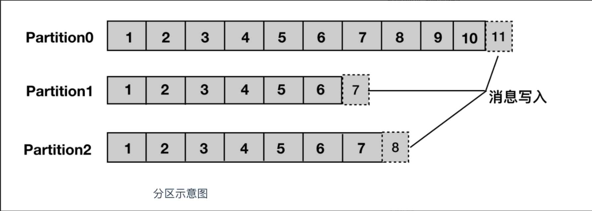
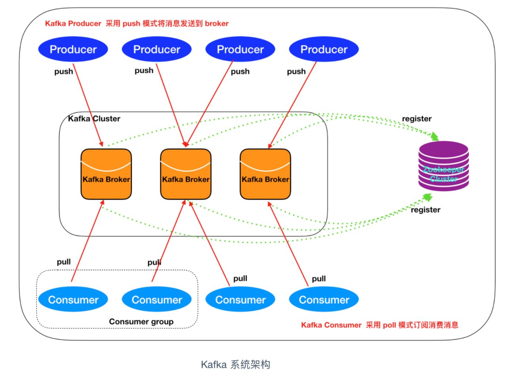

#### <font color="blue">Kafka入门</font>

---

# 什么是kafka

Kafka 是由 Linkedin 公司开发的，它是一个分布式的，支持多分区、多副本，基于 Zookeeper 的分布式消息流平台，它同时也是一款开源的基于发布订阅模式的消息引擎系统。它具备以下特性：

* 高吞吐、低延迟：kakfa 最大的特点就是收发消息非常快，kafka 每秒可以处理几十万条消息，它的最低延迟只有几毫秒。
* 高伸缩性： 每个主题(topic) 包含多个分区(partition)，主题中的分区可以分布在不同的主机(broker)中。
* 持久性、可靠性： Kafka 能够允许数据的持久化存储，消息被持久化到磁盘，并支持数据备份防止数据丢失，Kafka 底层的数据存储是基于 Zookeeper 存储的，Zookeeper 我们知道它的数据能够持久存储。
* 容错性： 允许集群中的节点失败，某个节点宕机，Kafka 集群能够正常工作
* 高并发： 支持数千个客户端同时读写

## 基本术语

* 消息：Kafka 中的数据单元被称为消息，也被称为记录，可以把它看作数据库表中某一行的记录。
* 批次：为了提高效率， 消息会分批次写入 Kafka，批次就代指的是一组消息。
* 主题：消息的种类称为 主题（Topic）,可以说一个主题代表了一类消息。相当于是对消息进行分类。主题就像是数据库中的表。
* 分区：主题可以被分为若干个分区（partition），同一个主题中的分区可以不在一个机器上，有可能会部署在多个机器上，由此来实现 kafka 的伸缩性，单一主题中的分区有序，但是无法保证主题中所有的分区有序

	
	
* 生产者： 向主题发布消息的客户端应用程序称为生产者（Producer），生产者用于持续不断的向某个主题发送消息。
* 消费者：订阅主题消息的客户端程序称为消费者（Consumer），消费者用于处理生产者产生的消息。
* 消费者群组：生产者与消费者的关系就如同餐厅中的厨师和顾客之间的关系一样，一个厨师对应多个顾客，也就是一个生产者对应多个消费者，消费者群组（Consumer Group）指的就是由一个或多个消费者组成的群体。
* 偏移量：偏移量（Consumer Offset）是一种元数据，它是一个不断递增的整数值，用来记录消费者发生重平衡时的位置，以便用来恢复数据。
* broker: 一个独立的 Kafka 服务器就被称为 broker，broker 接收来自生产者的消息，为消息设置偏移量，并提交消息到磁盘保存。
* broker 集群：broker 是集群 的组成部分，broker 集群由一个或多个 broker 组成，每个集群都有一个 broker 同时充当了集群控制器的角色（自动从集群的活跃成员中选举出来）。
* 副本：Kafka 中消息的备份又叫做 副本（Replica），副本的数量是可以配置的，Kafka 定义了两类副本：领导者副本（Leader Replica） 和 追随者副本（Follower Replica），前者对外提供服务，后者只是被动跟随。
* 重平衡：Rebalance。消费者组内某个消费者实例挂掉后，其他消费者实例自动重新分配订阅主题分区的过程。Rebalance 是 Kafka 消费者端实现高可用的重要手段。
	
## 系统架构



如上图所示，一个典型的 Kafka 集群中包含若干Producer（可以是web前端产生的Page View，或者是服务器日志，系统CPU、Memory等），若干broker（Kafka支持水平扩展，一般broker数量越多，集群吞吐率越高），若干Consumer Group，以及一个Zookeeper集群。Kafka通过Zookeeper管理集群配置，选举leader，以及在Consumer Group发生变化时进行rebalance。Producer使用push模式将消息发布到broker，Consumer使用pull模式从broker订阅并消费消息。

# 本地安装

1. 下载源码包：https://www.apache.org/dyn/closer.cgi?path=/kafka/2.4.1/kafka-2.4.1-src.tgz
2. 解压`tar zxvf kafka_2.12-2.4.1.tgz`后进入目录
3. 启动zookeeper：

	```js
	$ ./gradlew jar -PscalaVersion=2.12.10
	$ ./bin/zookeeper-server-start.sh config/zookeeper.properties
	```

4. 启动kafka

	```js
	$ ./bin/kafka-server-start.sh config/server.properties
	```
	
1. 将当前bin添加到PATH(也可把下列操作放到~/.zshrc中)
	
	```js
	$ export KAFKA=<当前路径>/bin
	$ export PATH=$KAFKA:$PATH
	```

1. 创建topic

	```js
	$ kafka-topics.sh --create --bootstrap-server localhost:9092 --replication-factor 1 --partitions 1 --topic test
	# 检查topic创建情况
	$ kafka-topics.sh --list --bootstrap-server localhost:9092
	```
	
	> 删除topic命令：`kafka-topics.sh --delete --bootstrap-server localhost:9092 --topic test`
	
1. 启动消费者

	```js
	$ kafka-console-consumer.sh --bootstrap-server localhost:9092 --topic test
	```

1. 启动生产者

	```js
	$ kafka-console-producer.sh --broker-list localhost:9092 --topic test
	```
	
	* 当你在生产者中输入任意字符时，消费者将会接收到并且同步打印
	* 如果在启动消费者的时候添加了`--from-beginning`参数，那么消费者会将生产者所有的历史输入都进行输出

---

> 参考链接：
> 
> * [掘金：Kafka 入门一篇文章就够了](https://juejin.im/post/5ddf5659518825782d599641)
> * [kafka doc: quick start](https://kafka.apache.org/quickstart)