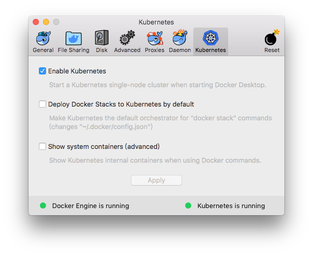

#### <font color="blue">Kubernetes使用Traefik反向代理</font>

---

# Traefik

* [官方地址](https://docs.traefik.io/)
* [github地址](https://github.com/containous/traefik)

# 反向代理实践(Deployment模式)

## 准备工作

1. 启动k8s: mac下载桌面版docker，打开`Enable Kubernetes`即可启动
	
	
	

1. [安装MiniKube](https://kubernetes.io/docs/tasks/tools/install-minikube/)
1. 启动MiniKube: `minikube start`

## 运行Traefik

1. 下载github代码: `git clone https://github.com/containous/traefik`
1. 进入`traefik/examples/k8s`目录
1. deployment模式部署，创建对外服务：`kubectl create -f traefik-deployment.yaml`

	> * 加载资源: `kubectl apply -f traefik-deployment.yaml`
	> * 去除资源：`kubectl delete -f traefik-deployment.yaml`
	
	```js
	kind: Service
	apiVersion: v1
	metadata:
	  name: traefik-ingress-service
	  namespace: kube-system
	spec:
	  selector:
	    k8s-app: traefik-ingress-lb
	  ports:
	    - protocol: TCP
	      port: 80
	      nodePort: 32044
	      name: web
	    - protocol: TCP
	      port: 8080
	      nodePort: 30423
	      name: admin
	  type: NodePort	
	```
	默认`type: NodePort`会随机指定一个对外服务端口，若需要设定指定的端口，要在ports里配置实际的nodePort
	
1. `kubectl get pods -n kube-system`可以看到`trafik-ingress-controller`已启动

	```js
	NAME                                         READY     STATUS    RESTARTS   AGE
	coredns-86c58d9df4-cffc8                     1/1       Running   0          8h
	coredns-86c58d9df4-n5dsv                     1/1       Running   0          8h
	etcd-minikube                                1/1       Running   0          7h
	kube-addon-manager-minikube                  1/1       Running   0          7h
	kube-apiserver-minikube                      1/1       Running   0          7h
	kube-controller-manager-minikube             1/1       Running   0          7h
	kube-proxy-ltkl5                             1/1       Running   0          8h
	kube-scheduler-minikube                      1/1       Running   1          7h
	storage-provisioner                          1/1       Running   0          8h
	traefik-ingress-controller-8c8b85bbc-9kn5p   1/1       Running   0          11m
	```
	
1. `kubectl get services -n kube-system`可以看到服务启动的ip和端口 

	```js                                                                                                       
	NAME                      TYPE        CLUSTER-IP     EXTERNAL-IP   PORT(S)                       AGE
	kube-dns                  ClusterIP   10.96.0.10     <none>        53/UDP,53/TCP                 7h
	traefik-ingress-service   NodePort    10.98.51.165   <none>        80:32044/TCP,8080:30423/TCP   11m
	```
	
	> * 访问`$(minikube ip):32044`可以看到当前对外端口返回的页面
	> * 访问`$(minikube ip):30423`可以看到当前Traefik的dashboard
	
## 配置服务路由
	
1. 启动后端服务

	```js
	kubectl apply -f cheese-deployments.yaml
	kubectl apply -f cheese-services.yaml
	```
	
1. `kubectl get services`可以看到，启动的TYPE都是ClusterIP，集群内部服务，不对外暴露端口

	```js
	NAME          TYPE        CLUSTER-IP       EXTERNAL-IP   PORT(S)   AGE
	cheddar       ClusterIP   10.98.97.163     <none>        80/TCP    17s
	kubernetes    ClusterIP   10.96.0.1        <none>        443/TCP   7h
	stilton       ClusterIP   10.108.91.83     <none>        80/TCP    17s
	wensleydale   ClusterIP   10.110.187.225   <none>        80/TCP    17s
	```

1. 通过Ingress建立路由规则：`kubectl apply -f cheeses-ingress.yaml`，配置如下：

	```js
	apiVersion: extensions/v1beta1
	kind: Ingress
	metadata:
	  name: cheeses
	  annotations:
	    traefik.frontend.rule.type: PathPrefixStrip
	spec:
	  rules:
	  - host: stilton.minikube
	    http:
	      paths:
	      - path: /
	        backend:
	          serviceName: stilton
	          servicePort: http
	  - host: cheeses.minikube
	    http:
	      paths:
	      - path: /cheddar
	        backend:
	          serviceName: cheddar
	          servicePort: http
	      - path: /wensleydale
	        backend:
	          serviceName: wensleydale
	          servicePort: http
	```

1. `kubectl describe ingress cheeses` 查看 Ingress

	```js
	Name:             cheeses
	Namespace:        default
	Address:
	Default backend:  default-http-backend:80 (<none>)
	Rules:
	  Host              Path  Backends
	  ----              ----  --------
	  stilton.minikube
	                    /   stilton:http (<none>)
	  cheeses.minikube
	                    /cheddar       cheddar:http (<none>)
	                    /wensleydale   wensleydale:http (<none>)
	Annotations:
	  kubectl.kubernetes.io/last-applied-configuration:  {"apiVersion":"extensions/v1beta1","kind":"Ingress","metadata":{"annotations":{"traefik.frontend.rule.type":"PathPrefixStrip"},"name":"cheeses","namespace":"default"},"spec":{"rules":[{"host":"stilton.minikube","http":{"paths":[{"backend":{"serviceName":"stilton","servicePort":"http"},"path":"/"}]}},{"host":"cheeses.minikube","http":{"paths":[{"backend":{"serviceName":"cheddar","servicePort":"http"},"path":"/cheddar"},{"backend":{"serviceName":"wensleydale","servicePort":"http"},"path":"/wensleydale"}]}}]}}
	
	  traefik.frontend.rule.type:  PathPrefixStrip
	Events:                        <none>
	```

1. 添加dns: `echo "$(minikube ip) cheeses.minikube stilton.minikube" | sudo tee -a /etc/hosts`
1. 开启rbac，授权角色访问dashboard权限`kubectl apply -f traefik-rbac.yaml`
1. 访问`$(minikube ip):30423`查看当前Traefik的dashboard

	
	
1. 访问以下地址，可以看到根据路由规则返回了相应的服务页面；访问其他地址会返回`404 not found`

	* `http://stilton.minikube:32044/`
	* `http://cheeses.minikube:32044/cheddar`
	* `http://cheeses.minikube:32044/wensleydale`


# Ingress 服务注册

当你启动一个新的服务时，可以通过Ingress将这个服务注册到相应的路由上去。

比如当你启动了一个名为cheddar的服务后，可以通过以下方式为它注册一条`cheeses.minikube/cheddar`的路由

```js
$ cat cheddar-ingress.yaml
apiVersion: extensions/v1beta1
kind: Ingress
metadata:
  name: cheddar
  annotations:
    traefik.frontend.rule.type: PathPrefixStrip
spec:
  rules:
  - host: cheeses.minikube
    http:
      paths:
      - path: /cheddar
        backend:
          serviceName: cheddar
          servicePort: http
          
$ kubectl apply -f cheddar-ingress.yaml
```

注意：

* 当你需要通过cheddar-ingress更新cheddar服务的路由时；在执行`kubectl apply -f cheddar-ingress.yaml`的过程中，cheddar-ingress会中断导致路由不可用
* 若使用新的`xxx-ingress.yaml`注册路由时，存在一条和已有路由重复的路由；会将该路由对应的服务更新为新注册的服务； **更新过程中，该路由会中断**

# 负载均衡

Traefik可以做到细粒度的负载均衡，适合做灰度发布。

比如我们现在有两个服务，cheddar和wensleydale，我们希望同一个入口75%的流量导向cheddar，25%的流量导向wensleydale，那么可以做以下配置

```js
$ cat cheeses-ingress.yaml
apiVersion: extensions/v1beta1
kind: Ingress
metadata:
  name: cheeses
  annotations:
    kubernetes.io/ingress.class: traefik
    traefik.frontend.rule.type: PathPrefixStrip
    traefik.ingress.kubernetes.io/service-weights: |
      cheddar: 75%
      wensleydale: 25%
spec:
  rules:
  - host: cheeses.minikube
    http:
      paths:
      - path: /
        backend:
          serviceName: cheddar
          servicePort: http
      - path: /
        backend:
          serviceName: wensleydale
          servicePort: http
          
$ kubectl apply -f cheeses-ingress.yaml
```

接下来批量访问`cheeses.minikube:32044/`，就会发现流量按照比例被导入到两个服务上去了

Traefik也支持默认自动配置。比如上面这个例子，如果你只配置了`wensleydale: 25%`，即便不配置`cheddar: 75%`，Traefik也会把余下75%的流量自动导入到cheddar上去。

# 配置服务优先级

Traefik-Ingress路由默认采用最长路径匹配原则，比如以下两个Ingress都使用前缀匹配

```js
$ cat cheddar-ingress.yaml
apiVersion: extensions/v1beta1
kind: Ingress
metadata:
  name: cheddar
  annotations:
    kubernetes.io/ingress.class: traefik
    traefik.frontend.rule.type: PathPrefixStrip
spec:
  rules:
  - host: cheeses.minikube
    http:
      paths:
      - path: /cheddar
        backend:
          serviceName: cheddar
          servicePort: http
          
$ cat wensleydale-ingress.yaml
apiVersion: extensions/v1beta1
kind: Ingress
metadata:
  name: wensleydale
  annotations:
    kubernetes.io/ingress.class: traefik
    traefik.frontend.rule.type: PathPrefixStrip
spec:
  rules:
  - host: cheeses.minikube
    http:
      paths:
      - path: /cheddar/wensleydale
        backend:
          serviceName: wensleydale
          servicePort: http
```

我们载入这两个Ingress：`kubectl apply -f cheddar-ingress.yaml`，`kubectl apply -f wensleydale-ingress.yaml`，当你访问`cheeses.minikube:32044/cheddar/wensleydale/xxx`时，请求会被分发到wensleydale服务上。

我们可以通过配置指定路由优先级，使用`traefik.ingress.kubernetes.io/priority`，对应的值越大，优先级越高。

```js
$ cat cheddar-ingress.yaml
apiVersion: extensions/v1beta1
kind: Ingress
metadata:
  name: cheddar
  annotations:
    kubernetes.io/ingress.class: traefik
    traefik.frontend.rule.type: PathPrefixStrip
    traefik.ingress.kubernetes.io/priority: "2"
spec:
  rules:
  - host: cheeses.minikube
    http:
      paths:
      - path: /cheddar
        backend:
          serviceName: cheddar
          servicePort: http
          
$ cat wensleydale-ingress.yaml
apiVersion: extensions/v1beta1
kind: Ingress
metadata:
  name: wensleydale
  annotations:
    kubernetes.io/ingress.class: traefik
    traefik.frontend.rule.type: PathPrefixStrip
    traefik.ingress.kubernetes.io/priority: "1"
spec:
  rules:
  - host: cheeses.minikube
    http:
      paths:
      - path: /cheddar/wensleydale
        backend:
          serviceName: wensleydale
          servicePort: http
```

此时访问`cheeses.minikube:32044/cheddar/wensleydale/xxx`时，请求会被分发到cheddar服务上。

---
	
> 参考链接
> 
> * [traefik kubernetes user guide](https://docs.traefik.io/user-guide/kubernetes/)
> * [traefik ingress provider](https://docs.traefik.io/configuration/backends/kubernetes/)
> * [kubernetes ingress](https://kubernetes.io/docs/concepts/services-networking/ingress/)
> * [kubernetes官网](https://kubernetes.io/zh/docs/concepts/overview/working-with-objects/kubernetes-objects/)
> * [kubernetes中文手册](http://hardocs.com/d/kubernetes/149-kubectl_describe.html)
> * [例程1](https://www.cnblogs.com/zhaojiankai/p/7898282.html)
> * [例程2](https://www.qikqiak.com/post/ingress-traefik1/)

## TODO

* apply的时候是否会中断服务: 见 **3. Ingress服务注册**

	* 版本快速切换做不到了
	* 前置lbc或nginx

* 日志
* 进入traefik pods
	
	* 没有各种sh
	
* rule reg
* opentracing
* ConfigMap
* deployment keepalive