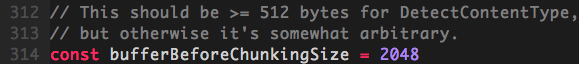

#### HTTP协议之chunk(分块传输编码)

---

# 分块传输编码

分块传输编码（Chunked transfer encoding）是超文本传输协议（HTTP）中的一种数据传输机制，允许HTTP由应用服务器发送给客户端应用（通常是网页浏览器）的数据可以分成多个部分。在HTTP协议1.1版本（HTTP/1.1）中提供。

> 通常，HTTP应答消息中发送的数据是整个发送的，Content-Length消息头字段表示数据的长度。数据的长度很重要，因为客户端需要知道哪里是应答消息的结束，以及后续应答消息的开始。然而，使用分块传输编码，数据分解成一系列数据块，并以一个或多个块流式传输，这样服务器可以发送数据而不需要预先知道发送内容的总大小。

HTTP 1.1引入分块传输编码提供了以下几点好处：

* HTTP分块传输编码允许服务器为动态生成的内容维持HTTP持久链接。通常，持久链接需要服务器在开始发送消息体前发送Content-Length消息头字段，但是对于动态生成的内容来说，在内容创建完之前是不可知的。
* 分块传输编码允许服务器在最后发送消息头字段。对于那些头字段值在内容被生成之前无法知道的情形非常重要，例如消息的内容要使用散列进行签名，散列的结果通过HTTP消息头字段进行传输。没有分块传输编码时，服务器必须缓冲内容直到完成后计算头字段的值并在发送内容前发送这些头字段的值。
* HTTP服务器有时使用压缩以缩短传输花费的时间。分块传输编码可以用来分隔压缩对象的多个部分。在这种情况下，块不是分别压缩的，而是整个负载进行压缩，压缩的输出使用本文描述的方案进行分块传输。在压缩的情形中，分块编码有利于一边进行压缩一边发送数据，而不是先完成压缩过程以得知压缩后数据的大小。

分块传输编码的格式：

* 如果一个HTTP消息（请求消息或应答消息）的Transfer-Encoding消息头的值为chunked，那么，消息体由数量未定的块组成，并以最后一个大小为0的块为结束。
* 每一个非空的块都以该块包含数据的字节数（字节数以十六进制表示）开始，跟随一个CRLF（回车及换行），然后是数据本身，最后块CRLF结束。在一些实现中，块大小和CRLF之间填充有白空格（0x20）。
* 最后一块是单行，由块大小（0），一些可选的填充白空格，以及CRLF。最后一块不再包含任何数据，但是可以发送可选的尾部，包括消息头字段。消息最后以CRLF结尾。

> 参考链接:
> 
> * [wiki: 分块传输编码](https://zh.wikipedia.org/wiki/%E5%88%86%E5%9D%97%E4%BC%A0%E8%BE%93%E7%BC%96%E7%A0%81)

# golang http server 与 chunked

golang http 包中，处理请求返回的response结构体里，用于写入body的Writer是一个chunkWriter。我们可以通过官方包`net/http/server.go: func (c *conn) readRequest(ctx context.Context) (w *response, err error)`方法看到：

这里使用w.cw(chunkWriter)生成一个`*bufio.Writer`，并赋值给w.w(response.Writer)，设定的bufferSize为`bufferBeforeChunkingSize`。http包中，`bufferBeforeChunkingSize`的值为2048

`net/http/server.go: func (cw *chunkWriter) writeHeader(p []byte)`
