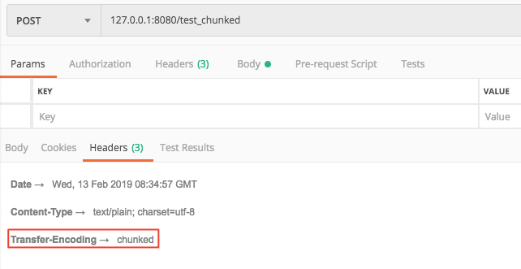
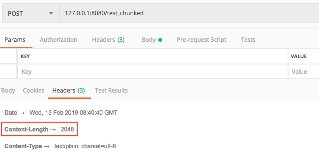
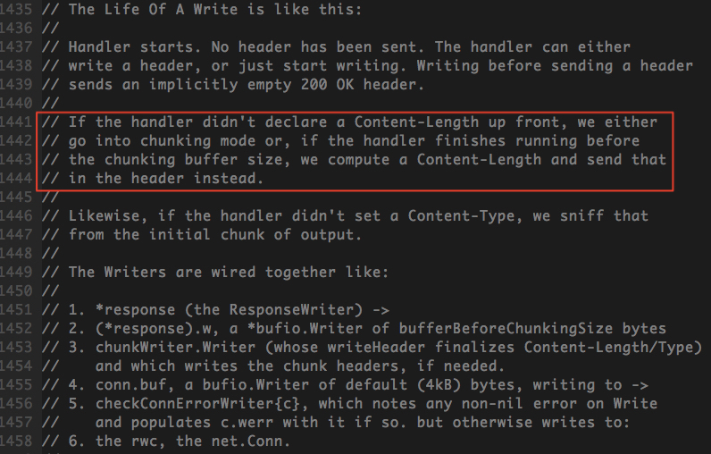
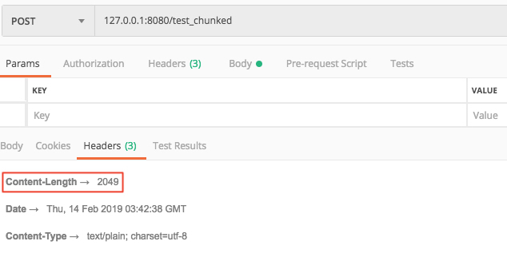
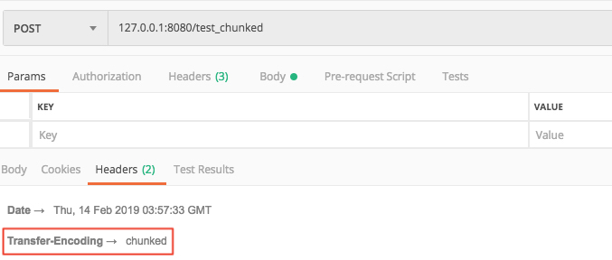

#### <font color="blue">HTTP协议之chunk(分块传输编码)</font>

---

# 分块传输编码

分块传输编码（Chunked transfer encoding）是超文本传输协议（HTTP）中的一种数据传输机制，允许HTTP由应用服务器发送给客户端应用（通常是网页浏览器）的数据可以分成多个部分。在HTTP协议1.1版本（HTTP/1.1）中提供。

> 通常，HTTP应答消息中发送的数据是整个发送的，Content-Length消息头字段表示数据的长度。数据的长度很重要，因为客户端需要知道哪里是应答消息的结束，以及后续应答消息的开始。然而，使用分块传输编码，数据分解成一系列数据块，并以一个或多个块流式传输，这样服务器可以发送数据而不需要预先知道发送内容的总大小。

HTTP 1.1引入分块传输编码提供了以下几点好处：

* HTTP分块传输编码允许服务器为动态生成的内容维持HTTP持久链接。通常，持久链接需要服务器在开始发送消息体前发送Content-Length消息头字段，但是对于动态生成的内容来说，在内容创建完之前是不可知的。
* 分块传输编码允许服务器在最后发送消息头字段。对于那些头字段值在内容被生成之前无法知道的情形非常重要，例如消息的内容要使用散列进行签名，散列的结果通过HTTP消息头字段进行传输。没有分块传输编码时，服务器必须缓冲内容直到完成后计算头字段的值并在发送内容前发送这些头字段的值。
* HTTP服务器有时使用压缩以缩短传输花费的时间。分块传输编码可以用来分隔压缩对象的多个部分。在这种情况下，块不是分别压缩的，而是整个负载进行压缩，压缩的输出使用本文描述的方案进行分块传输。在压缩的情形中，分块编码有利于一边进行压缩一边发送数据，而不是先完成压缩过程以得知压缩后数据的大小。

分块传输编码的格式：

* 如果一个HTTP消息（请求消息或应答消息）的Transfer-Encoding消息头的值为chunked，那么，消息体由数量未定的块组成，并以最后一个大小为0的块为结束。传输过程中的消息头没有Content-Length字段
* 每一个非空的块都以该块包含数据的字节数（字节数以十六进制表示）开始，跟随一个CRLF（回车及换行），然后是数据本身，最后块CRLF结束。在一些实现中，块大小和CRLF之间填充有白空格（0x20）。
* 最后一块是单行，由块大小（0），一些可选的填充白空格，以及CRLF。最后一块不再包含任何数据，但是可以发送可选的尾部，包括消息头字段。消息最后以CRLF结尾。

> 参考链接:
> 
> * [wiki: 分块传输编码](https://zh.wikipedia.org/wiki/%E5%88%86%E5%9D%97%E4%BC%A0%E8%BE%93%E7%BC%96%E7%A0%81)

# golang http server 与 chunk

golang http 包中，处理请求返回的response结构体里，用于写入body的Writer是一个chunkWriter。我们可以通过官方包`net/http/server.go: func (c *conn) readRequest(ctx context.Context) (w *response, err error)`方法看到：


这里使用w.cw(定义为response.chunkWriter)生成一个`*bufio.Writer`，设定buffer大小为`bufferBeforeChunkingSize`，并赋值给w.w(定义为response.Writer)。在http包中，`bufferBeforeChunkingSize`的值为2048


因此，当返回的response写入的内容超过2048个字节时，golang的http包底层会自动进行分块传输编码(chunk)。这里我们可以通过一个简单的demo来验证一下：

```js
package main

import (
	"bytes"
	"log"
	"net/http"
)

func main() {
	handler := func(w http.ResponseWriter, req *http.Request) {
		unitByte := []byte("1")
		w.Write(bytes.Repeat(unitByte, 2049))
	}

	http.HandleFunc("/test_chunked", handler)
	log.Fatal(http.ListenAndServe(":8080", nil))
}
```

这里我们返回2049个字符。访问`127.0.0.1:8080/test_chunked`，看一下返回的消息头



可以看到，当返回的传输字节超过2048时，服务端的返回默认使用了分块传输编码，头部不包含Content-Length。

> 对于"Transfer-Encoding"为chunked的response，golang的http包会在`WriteBody`时自动补上分块传输编码分隔的CRLF换行符；客户端收到response后按照分块传输编码，解码拼接成完整的报文。

接下来，我们将返回body的内容设置为为2048个字节

```js
w.Write(bytes.Repeat(unitByte, 2048))
```

看一下修改后返回的消息头



可以看到，返回的消息头里明确设定了Content-Length，采用正常整包传输。

# 自动chunk可能带来的问题

服务端返回chunked报文时需要考虑接收方是否能够正确解析。比如接收方使用低版本的python httplib包发起请求，就可能因返回报文头部没有确切的报文长度而导致解析失败

```js
File "entities/common_server/Lib/httplib.py", line 588, in read
       return self._read_chunked(amt)
File "entities/common_server/Lib/httplib.py", line 642, in _read_chunked
       raise IncompleteRead(''.join(value))
httplib.IncompleteRead: IncompleteRead(0 bytes read)
```

由于分块传输编码是HTTP/1.1后新增的功能，一些低版本的程序支持HTTP/1.0，但是对HTTP/1.1没有很好的支持，就可能导致解析分块传输报文失败。

# 设置golang http服务器是否chunk

虽然golang底层帮我们做了报文自动chunk，但是我们能不能根据服务器的实际需要，显式地设定返回报文是否chunk呢？答案是肯定的。



以上是golang http官方包对response的写接口`Write`的生存周期说明。服务器默认写入body的时候，是没有设定Content-Length的；如果传输的body长度不超过`chunking buffer size`(2048字节)，http包会根据自动计算的body长度设定Content-Length，进行整包传输；如果超过了2048字节，就会进行分块传输。

## 设置no-chunk


通过官方包`net/http/transfer.go: func newTransferWriter(r interface{}) (t *transferWriter, err error)`方法可以看到，设定chunked的一个首要条件是`t.ContentLength < 0`。golang http包对t.ContentLength的值是按照以下顺序进行设置的：

1. 若Body为空，则设为0
2. 若设定了头部的"Content-Length"，则使用设定的"Content-Length"（当设定的Content-Length和实际写入的Body大小不一致时，在调用`net/http/transfer.go: func (t *transferWriter) WriteBody(w io.Writer) error`方法写入body时会报错）
3. 若没有设定头部的"Content-Length"，则设为-1

因此，只要我们显式地设置http返回头部的"Content-Length"，就可以让golang服务器不进行分块传输。

```js
package main

import (
	"bytes"
	"log"
	"net/http"
	"strconv"
)

func main() {
	handler := func(w http.ResponseWriter, req *http.Request) {
		body := bytes.Repeat([]byte("1"), 2049)
		w.Header().Set("Content-Length", strconv.Itoa(len(body)))
		w.Write(body)
	}

	http.HandleFunc("/test_chunked", handler)
	log.Fatal(http.ListenAndServe(":8080", nil))
}
```

这里我们通过`w.Header().Set("Content-Length", strconv.Itoa(len(body)))`的方法设定了头部长度。访问`127.0.0.1:8080/test_chunked`，看一下返回的消息头



可以看到，虽然body长度超过了2048，但是返回的消息仍然采用了整包传输(没有设定chunked)

## 设置chunk


还是上面这个方法，可以看到，除了"Content-Length"外，"Transfer-Encoding"也是服务器设置chunked的条件之一。golang http包默认对2048字节以上的body做分块传输，那么如果我们想要对2048字节以下的body也进行分块传输，只要显式地设置http返回头部的"Transfer-Encoding"为chunked即可。

```js
package main

import (
	"bytes"
	"log"
	"net/http"
)

func main() {
	handler := func(w http.ResponseWriter, req *http.Request) {
		body := bytes.Repeat([]byte("1"), 2047)
		w.Header().Set("Transfer-Encoding", "chunked")
		w.Write(body)
	}

	http.HandleFunc("/test_chunked", handler)
	log.Fatal(http.ListenAndServe(":8080", nil))
}
```

这里我们返回的body长度只有2047(< 2048字节)，但是设置了Transfer-Encoding为chunked。访问`127.0.0.1:8080/test_chunked`，看一下返回的消息头



可以看到，这里使用了分块传输编码，头部不设定"Content-Length"。

# 总结

* HTTP/1.1中引入了更高效的数据传输方式 —— 分块传输编码。
* golang的http包在传输数据body超过2048字节时，会自动采用分块传输编码(chunk)。
* 当显式地设置response头部的"Content-Length"后，golang将强制采用整包传输，不会使用分块传输编码。
* 当显式地设置response头部的"Transfer-Encoding"为chunked后，golang将强制采用分块传输编码。
