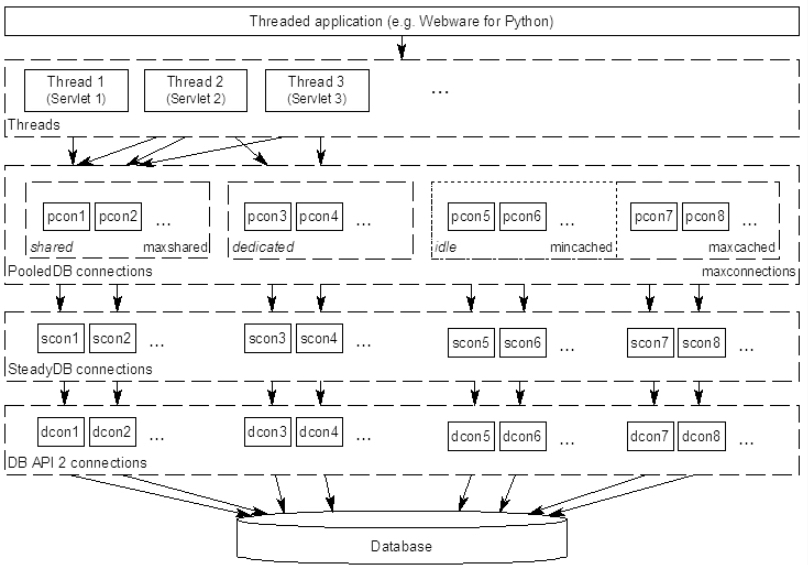

#### <font color="blue">python数据库连接池DBUtils</font>

---

# 概述

当我们的程序需要复用数据库连接时，使用连接池替代短连接可以提高数据库的访问效率，避免频繁地创建和销毁数据库连接。python的第三方库DBUtils提供了高效、线程安全的连接池。

DBUtils提供三种类型的数据库连接，分别是：

* SteadyDB
* PersistentDB
* PooledDB

## SteadyDB

SteadyDB提供了一种“强硬”的数据库连接，当数据库连接丢失或断开时，它会强制重连。它是DBUtils实现的一种最基本的数据库连接，底层采用[DB-API 2规范](https://www.python.org/dev/peps/pep-0249/)的数据库模型。通常我们不直接使用SteadyDB，而是使用以下两种封装了SteadyDB的连接类型：PersistentDB和PooledDB。

## PersistentDB

PersistentDB实现了一种线程安全的数据库连接池


1. 当一个线程a启用数据库连接时，PersistentDB会打开一个专供该线程使用的数据库连接
2. 当线程a关闭数据库连接时，该数据库连接会继续保持open状态，下次线程a调用时可以直接使用
3. 直到线程a消亡时，该数据库连接会自动关闭

PersistentDB可以在同一个线程中通过连接复用来提高数据库访问效率；但是同一个数据库连接不能在不同线程间复用，最大限度地保证数据库连接的线程安全。

## PooledDB

PooledDB同样提供了线程安全的数据库连接池，和PersistentDB的区别是：同一个连接可以在不同线程间复用。



* PooledDB提供了`mincached`和`maxcached`选项；分别用于指定连接池的初始化连接数，以及连接池里允许的最大空闲连接数
* PooledDB提供了`maxshared`选项，用于设定共享连接池大小。当打开一个数据库连接时，只有在配置了`maxshared > 0`才会创建`PooledSharedDBConnection`，从`_shared_cache`中取出连接供不同线程共用；默认该参数为0，创建的是`PooledDedicatedDBConnection`，从当前空闲的连接池中取一个连接供当前线程专用，使用完毕后放回空闲连接池中

	* `maxshared`参数只有在`creator.threadsafety > 1`时才生效
	* 由于pymysql和MySQLdb模块的threadsafety都为1，因此当使用这些模块作为creator时，`maxshared`不生效，使用的都是`PooledDedicatedDBConnection`
	
	

> 实际上还有一种SimplePooledDB，实现了基本的连接池功能；但是它比起PooledDB少了故障重连功能，因此官方文档上不建议将其直接用于生产环境

# 使用

示例代码：

```js
# coding: utf-8
import pymysql
from DBUtils.PooledDB import PooledDB
import threading
import time

dbopt = {
    'user': 'root',
    'passwd': 'test',
    'host': '127.0.0.1',
    'port': 3306,
    'connect_timeout': 5,
    'write_timeout': 5,
    'read_timeout': 5,
    'db': 'DM0'
}

db_pool = PooledDB(
    creator=pymysql,  # 使用数据库连接的模块
    maxconnections=10,  # 连接池允许的最大连接数，0和None表示不限制连接数
    mincached=2,  # 初始化时，连接池中至少创建的空闲的链接，0表示不创建
    maxcached=5,  # 连接池中最多闲置的链接，0和None不限制
    maxshared=0,  # 连接池中最多共享的链接数量，0表示不共享。PS: 无用，因为pymysql和MySQLdb等模块的 threadsafety都为1，此值只有在creator.threadsafety > 1时设置才有效，否则创建的都是dedicated connection，即此连接是线程专用的。
    blocking=True,  # 连接池中如果没有可用连接后，是否阻塞等待。True，等待；False，不等待然后报错
    maxusage=None,  # 一个连接最多被重复使用的次数，None表示无限制
    setsession=["set autocommit=1"],  # 开始会话前执行的命令列表。如：["set datestyle to ...", "set time zone ..."]；务必要设置autocommit，否则可能导致该session的sql未提交
    ping=1,  # 每次从pool中取连接时ping一次检查可用性
    reset=False,  # 每次将连接放回pool时，将未提交的内容回滚；False时只对事务操作进行回滚
    **dbopt
)


class DBThread (threading.Thread):
    def __init__(self, threadID):
        threading.Thread.__init__(self)
        self.threadID = threadID

    def run(self):
        conn = db_pool.connection()
        cur = conn.cursor(pymysql.cursors.DictCursor)
        cur.execute("INSERT INTO TestTb(name) VALUES(%s)", ["t-{0}".format(self.threadID), ])
        print "thread-{0}".format(self.threadID)


if __name__ == "__main__":
    time.sleep(10)
    for i in xrange(100):
        t = DBThread(i)
        t.start()
    time.sleep(10)
```

* DBUtils的使用方式很简单，通过`PooledDB()`创建连接池；然后通过`connection()`方法取出连接进行操作即可
* 这里我们创建了100个线程进行并发插入操作，设定最大数据库连接数maxconnections为10
* DBUtils建立的是惰性连接，也就是只有调用`connection()`取出连接时才会和数据库建立实际的连接，一开始创建PooledDB时是不建立实际连接的；不过可以通过mincached参数设定连接池初始化的连接数，这里我们设定`mincached=2`。可以看到，在线程并发操作前，就已经建立了两个数据库连接

	```js
	+------+------+-----------------+-----+---------+------+----------+-----------------------+
	| Id   | User | Host            | db  | Command | Time | State    | Info                  |
	+------+------+-----------------+-----+---------+------+----------+-----------------------+
	| 4423 | root | localhost:58091 | dm0 | Sleep   | 4    |          | <null>                |
	| 4424 | root | localhost:58092 | dm0 | Sleep   | 4    |          | <null>                |
	+------+------+-----------------+-----+---------+------+----------+-----------------------+
	```

* 线程并发数据库操作完成后，PooledDB会保持和数据库的连接；这里我们设定了连接池最大连接数`maxconnections=10`，当数据库操作完成后，仍然会有10个连接keepalive
* 可以通过maxcached参数设定最大闲置连接数，这里我们设定`maxcached=5`，数据库操作完成后，只有5个闲置连接保留

	```js
	+------+------+-----------------+-----+---------+------+----------+-----------------------+
	| Id   | User | Host            | db  | Command | Time | State    | Info                  |
	+------+------+-----------------+-----+---------+------+----------+-----------------------+
	| 4425 | root | localhost:58093 | dm0 | Sleep   | 5    |          | <null>                |
	| 4427 | root | localhost:58095 | dm0 | Sleep   | 5    |          | <null>                |
	| 4428 | root | localhost:58096 | dm0 | Sleep   | 5    |          | <null>                |
	| 4430 | root | localhost:58098 | dm0 | Sleep   | 5    |          | <null>                |
	| 4434 | root | localhost:58102 | dm0 | Sleep   | 5    |          | <null>                |
	+------+------+-----------------+-----+---------+------+----------+-----------------------+
	```
	
* 查看数据库表，正常入库了100条数据

	```js
	mysql root@localhost:DM0> select count(distinct name) from TestTb;
	+----------------------+
	| count(distinct name) |
	+----------------------+
	| 100                  |
	+----------------------+
	```
	
* 需要注意的是，创建连接池时必须设定`setsession=["set autocommit=1"]`，保证连接池内每个会话的sql能够及时提交；当数据库连接断线重连时，新建的连接也会执行这个`setsession`操作

> 参考链接：
> 
> * [DBUtils官方指南](https://cito.github.io/w4py-olde-docs/Webware/DBUtils/Docs/UsersGuide.html)