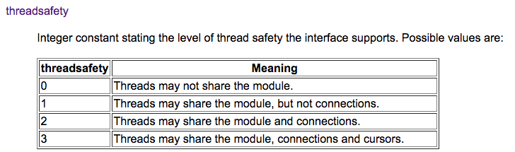

#### python数据库连接池DBUtils

---

# 概述

当我们的程序需要复用数据库连接时，使用连接池替代短连接可以提高数据库的访问效率，避免频繁地创建和销毁数据库连接。python的第三方库DBUtils提供了高效、线程安全的连接池。

DBUtils提供三种类型的数据库连接，分别是：

* SteadyDB
* PersistentDB
* PooledDB

## SteadyDB

SteadyDB提供了一种“强硬”的数据库连接，当数据库连接丢失或断开时，它会强制重连。它是DBUtils实现的一种最基本的数据库连接，底层采用[DB-API 2规范](https://www.python.org/dev/peps/pep-0249/)的数据库模型。通常我们不直接使用SteadyDB，而是使用以下两种封装了SteadyDB的连接类型：PersistentDB和PooledDB。

## PersistentDB

PersistentDB实现了一种线程安全的数据库连接池

1. 当一个线程a启用数据库连接时，PersistentDB会打开一个专供该线程使用的数据库连接
2. 当线程a关闭数据库连接时，该数据库连接会继续保持open状态，下次线程a调用时可以直接使用
3. 直到线程a消亡时，该数据库连接会自动关闭

PersistentDB可以在同一个线程中通过连接复用来提高数据库访问效率；但是同一个数据库连接不能在不同线程间复用，最大限度地保证数据库连接的线程安全。

## PooledDB

PooledDB同样提供了线程安全的数据库连接池，和PersistentDB的区别是：同一个连接可以在不同线程间复用。

* PooledDB提供了`mincached`和`maxcached`选项；分别用于指定连接池的初始化连接数，以及连接池里允许的最大空闲连接数
* PooledDB提供了`maxshared`选项，用于设定共享连接池大小。当打开一个数据库连接时，只有在配置了`maxshared > 0`才会创建`PooledSharedDBConnection`，从`_shared_cache`中取出连接供不同线程共用；默认该参数为0，创建的是`PooledDedicatedDBConnection`，从当前空闲的连接池中取一个连接供当前线程专用，使用完毕后放回空闲连接池中

	* `maxshared`参数只有在`creator.threadsafety > 1`时才生效
	* 由于pymysql和MySQLdb模块的threadsafety都为1，因此当使用这些模块作为creator时，`maxshared`不生效，使用的都是`PooledDedicatedDBConnection`
	
	

> 实际上还有一种SimplePooledDB，实现了基本的连接池功能；但是它比起PooledDB少了故障重连功能，因此官方文档上不建议将其直接用于生产环境

> 参考链接：
> 
> * [DBUtils官方指南](https://cito.github.io/w4py-olde-docs/Webware/DBUtils/Docs/UsersGuide.html)